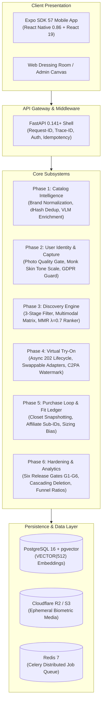

# FashXStudio: AI Personal Fashion Operating System (AFS)

[](https://www.python.org/)
[](https://fastapi.tiangolo.com/)
[](https://www.sqlalchemy.org/)
[](https://github.com/pgvector/pgvector)
[](https://expo.dev/)
[-brightgreen.svg)]()
[]()
[](LICENSE)

> **FashXStudio** is an **AI Personal Fashion Operating System** that understands the consumer, ingests and normalizes products across multiple merchants, generates hyper-personalized outfits with stylistic reasoning, executes photorealistic 2D/3D virtual try-ons on the user's authentic body profile, and learns sizing calibration directly from real-world fit feedback.

---

## Architecture & Subsystems

The platform is designed as a **Modular Monolith** governed by a strict **5-Layer Clean Architecture** and the **20 Engineering Constitution Rules (I01–I20)**:

$$\text{HTTP Router} \longrightarrow \text{Application Use Cases} \longrightarrow \text{Pure Domain Layer} \longrightarrow \text{Repository / Unit of Work} \longrightarrow \text{Integration Ports \& Adapters}$$



---

## Key Technical Highlights

### 1. Catalog Intelligence & VLM Enrichment (Phase 1)
- **Multi-Merchant Normalization**: Strips promotional noise, standardizes naming across Amazon, Myntra, Flipkart, and Shopify.
- **Deduplication Engine**: Dual-key deduplication combining perceptual difference hash (`dHash`, Hamming distance $\le 4$) and canonical text content SHA-256.
- **Vision-Language Enrichment**: Extracts fine-grained attributes (`silhouette`, `dominant_color`, `neckline`, `fabric`) and generates 512-dimensional multimodal embeddings.
- **Size Chart Normalization**: Centimeter conversion engine mapping multi-brand alpha sizing (`XS` to `XXL`) to physical body dimensions.

### 2. User Identity & Capture Intelligence (Phase 2)
- **Pre-Inference Photo Quality Gate**: Asserts exposure sanity, contrast, sharpness, eye-level orientation, and minimum portrait resolution before invoking costly GPU pipelines.
- **Monk Skin Tone Calibration**: Classifies skin tone against the 10-point Monk Skin Tone (MST) scale and determines color undertone (`warm`, `cool`, `neutral`) using Euclidean Lab color space centroid matching.
- **GDPR / DPDP Consent Guard**: Enforces explicit separation between ephemeral visual processing and machine learning training.

### 3. Personalized 3-Stage Discovery Engine (Phase 3)
- **Stage 1 (Hard Filter)**: Sub-5ms deterministic SQL filtering on budget, in-stock status, and avoided categories/colors.
- **Stage 2 (Multimodal Compatibility)**: Evaluates color wheel harmony (complementary, analogous, triadic) and physical silhouette alignment.
- **Stage 3 (Maximal Marginal Relevance Ranker)**: Balances personal preference affinity against feed diversity ($\lambda=0.7$) to eliminate catalog echo chambers.
- **Natural Language Stylist Explainer**: Dynamically articulates *why* each garment complements the user's specific skin undertone and body build.

### 4. Asynchronous Virtual Try-On Engine (Phase 4)
- **Asynchronous 202 Accepted Lifecycle**: Decouples client request from GPU worker execution with lease-based state tracking (`queued` $\to$ `running` $\to$ `completed` / `failed`).
- **Swappable Model Adapters**: Standardized `TryOnModelAdapter` interface supporting `MockAdapter`, `ResearchDiffusionAdapter` (IDM-VTON / CatVTON), and `CommercialApiAdapter`.
- **C2PA Synthetic Watermarking**: Injects invisible cryptographic provenance metadata and visible corner brand identifiers to guarantee AI transparency.
- **Composite SHA-256 Cache Invalidation Key**: Incorporates `(user_photo_hash + garment_hash + body_model_version + render_config_hash)` to achieve high cache reuse.

### 5. Purchase Loop & Fit Learning Engine (Phase 5)
- **Virtual Closet Snapshotting**: Preserves immutable point-in-time pricing, currency, title, and primary render artifact.
- **Outbound Affiliate Handoff**: Generates tracked checkout URLs with unique attribution sub-IDs (`fashx_{user_id}_{token}`) and UTM parameters.
- **Granular Fit Feedback Ledger**: Captures purchase sizing observations to compute dynamic brand sizing bias:
  $$\text{SizingBias} = \frac{N(\text{too\_loose}) - N(\text{too\_tight})}{N_{\text{total}}}$$
  Automatically recommends sizing up or down based on empirical community returns.

### 6. Production Hardening & Six Release Gates (Phase 6 / Foundations 18–20)
- **Automated Production Readiness Auditor**:
  - **Gate G1 (Functional Readiness)**: 10-step full consumer lifecycle pass rate.
  - **Gate G2 (ML Quality)**: VLM completeness $\ge 95\%$, Monk calibration $\Delta E < 2.0$.
  - **Gate G3 (Performance)**: API p95 $\le 150\text{ms}$, Feed latency $\le 300\text{ms}$, Try-On $\le 6\text{s}$.
  - **Gate G4 (Privacy Compliance)**: Zero residual leaks post-consent revocation; atomic cascading hard erasure of database records and object storage.
  - **Gate G5 (Commercial Clearance)**: Zero un-cleared research weights active in production environments.
  - **Gate G6 (User Acceptance)**: $\ge 75\%$ try-on realism satisfaction, $\ge 80\%$ feed relevance.
- **MVP Analytics & Validation Layer**: Queries operational database via indexed read-models for session events, funnel counts, and diagnostic conversion ratios.

---

## The 20 Engineering Constitution Rules

1. **I01 (Layer Separation)**: Routers handle HTTP; use cases execute business logic; domain is pure; repositories manage persistence.
2. **I02 (Contract Primacy)**: Shared Pydantic v2 schemas in `/schemas` are versioned; no undeclared fields (`extra="forbid"`).
3. **I03 (Pure Domain)**: Domain entities contain zero framework, database, or network SDK imports.
4. **I04 (Unit of Work)**: Atomic database transactions with explicit commit and automatic rollback on error.
5. **I05 (Idempotency Key Distinctness)**: `Idempotency-Key` (request deduplication) $\ne$ `Cache-Key` (content hash).
6. **I06 (Biometric Security)**: Raw portrait media is stored in object storage (R2/S3); never binary blobs in Postgres.
7. **I07 (Pre-Inference Quality Gate)**: Low-quality, blurry, or misaligned photos fail before invoking GPU inference.
8. **I08 (Commercial Weight Clearance)**: Research-only model weights are blocked from production deployments.
9. **I09 (Deterministic Normalization)**: Merchant products normalize into canonical garments with deduplication keys.
10. **I10 (3-Stage Discovery)**: Hard filter $\to$ Compatibility scoring $\to$ MMR diversity ranking.
11. **I11 (Wardrobe Snapshotting)**: Saved closet items record frozen price and metadata at time of save.
12. **I12 (Affiliate Attribution)**: Outbound merchant clicks generate traceable `fashx_` sub-IDs.
13. **I13 (Fit Feedback Ledger)**: Real-time brand calibration bias derived from granular post-purchase feedback.
14. **I14 (Try-On Realism Scoring)**: Users rate visual fidelity (1–5) to continuously monitor model drift.
15. **I15 (C2PA Watermarking)**: Synthetic try-on images receive digital watermarks for AI disclosure compliance.
16. **I16 (Cascading Hard Erasure)**: Consent revocation triggers immediate hard deletion of photos from DB and object storage.
17. **I17 (Six Release Gates)**: Formal evaluation of G1–G6 gates prior to staging promotion.
18. **I18 (End-to-End Test Integrity)**: Full 10-step consumer journey verified in a single transactional integration test.
19. **I19 (Standardized Error Envelopes)**: All error responses use RFC-7807 compliant error format.
20. **I20 (Observability & Tracing)**: Every request propagates `X-Request-ID` and `X-Trace-ID` through structured JSON logs.

---

## Database Migration Chain (Alembic)

The PostgreSQL 16 + pgvector schema is managed via 12 incremental migrations:

```
0001_foundation
      ↓
0002_domain_foundation
      ↓
0003_operations_and_vector_upgrade
      ↓
0004_profile_media_jobs
      ↓
0005_profile_photo_validation
      ↓
0006_capture_quality
      ↓
0007_profile_intelligence
      ↓
0008_catalog_runtime
      ↓
0009_tryon_job_runtime
      ↓
0010_tryon_result_quality
      ↓
0011_tryon_feedback_instrumentation
      ↓
0012_analytics_indexes
```

---

## Core API Endpoints

| Method | Endpoint | Description |
|:---|:---|:---|
| `GET` | `/api/v1/system/health/live` | Liveness probe |
| `GET` | `/api/v1/system/health/ready` | Database & Redis readiness probe |
| `POST` | `/api/v1/profile` | Create user profile & capture initial biometric measurements |
| `POST` | `/api/v1/profile/{user_id}/photos` | Upload reference portrait (runs quality validator & Monk calibrator) |
| `POST` | `/api/v1/profile/{user_id}/preferences` | Update style preferences, avoided colors & budget |
| `POST` | `/api/v1/profile/{user_id}/consent/revoke` | Revoke consent and execute cascading hard deletion of biometric data |
| `POST` | `/api/v1/catalog/products/ingest` | Ingest merchant product & establish canonical garment |
| `POST` | `/api/v1/catalog/garments/{id}/enrich` | Trigger VLM attribute extraction & 512-dim embedding generation |
| `GET` | `/api/v1/feed` | Generate personalized 3-stage feed with stylist explanations |
| `POST` | `/api/v1/tryon/jobs` | Submit asynchronous try-on job (returns 202 Accepted or cache hit) |
| `GET` | `/api/v1/tryon/jobs/{job_id}` | Poll try-on job status & retrieve watermarked result URL |
| `POST` | `/api/v1/wardrobe/items` | Save garment to virtual closet with price snapshot |
| `POST` | `/api/v1/commerce/buy-clicks` | Generate tracked outbound affiliate redirect URL |
| `POST` | `/api/v1/feedback/fit` | Log granular post-purchase fit outcome & update brand bias |
| `POST` | `/api/v1/feedback/tryon` | Record try-on realism & purchase confidence scores |
| `POST` | `/api/v1/analytics/session-events` | Ingest mobile session start/end telemetry |
| `GET` | `/api/v1/analytics/validation` | Internal validation dashboard (funnel counts & conversion ratios) |

---

## Local Setup & Quickstart

### Prerequisites
- Python 3.12+
- Docker & Docker Compose
- Node.js 20+ & Expo CLI (for mobile app)

### 1. Environment Setup
```bash
cp .env.example .env
```

### 2. Launch Local Infrastructure
```bash
docker compose up -d postgres redis
```

### 3. Apply Database Migrations
```bash
python -m alembic upgrade head
```

### 4. Run Automated Test Suite
```bash
# Run all 663 unit, domain, integration, and cross-core tests
$env:PYTHONPATH=".;api"
python -m pytest tests -p no:cacheprovider -v
```

### Documentation & Milestone Task Logs
- [Core Services C01–C24 Deep-Dive Audit & Task Log](docs/task-log-core-services-c01-c24.md)
- [Feature Platform F10–F16 Task Log](docs/task-log-feature-build-f10-f16.md)
- [Feature Platform F00–F09 Task Log](docs/task-log-feature-build-f00-f09.md)
- [Feature Platform Architecture](docs/feature-platform.md)
- [Production Release Readiness](docs/release-readiness-f16.md)


### 5. Start FastAPI Backend
```bash
python -m uvicorn api.app.main:app --reload --port 8000
```
Interactive documentation will be available at:
- **Swagger UI**: [http://127.0.0.1:8000/docs](http://127.0.0.1:8000/docs)
- **ReDoc**: [http://127.0.0.1:8000/redoc](http://127.0.0.1:8000/redoc)

### 6. Start Mobile App (Expo)
```bash
cd mobile
npm install
npx expo start
```

---

## Commercial License

This software and all associated architectures, pipelines, and models are licensed under the **FashXStudio Commercial Proprietary License**. See [LICENSE](LICENSE) for full legal terms.

Copyright (c) 2026 Sahil Khutey. All Rights Reserved.
