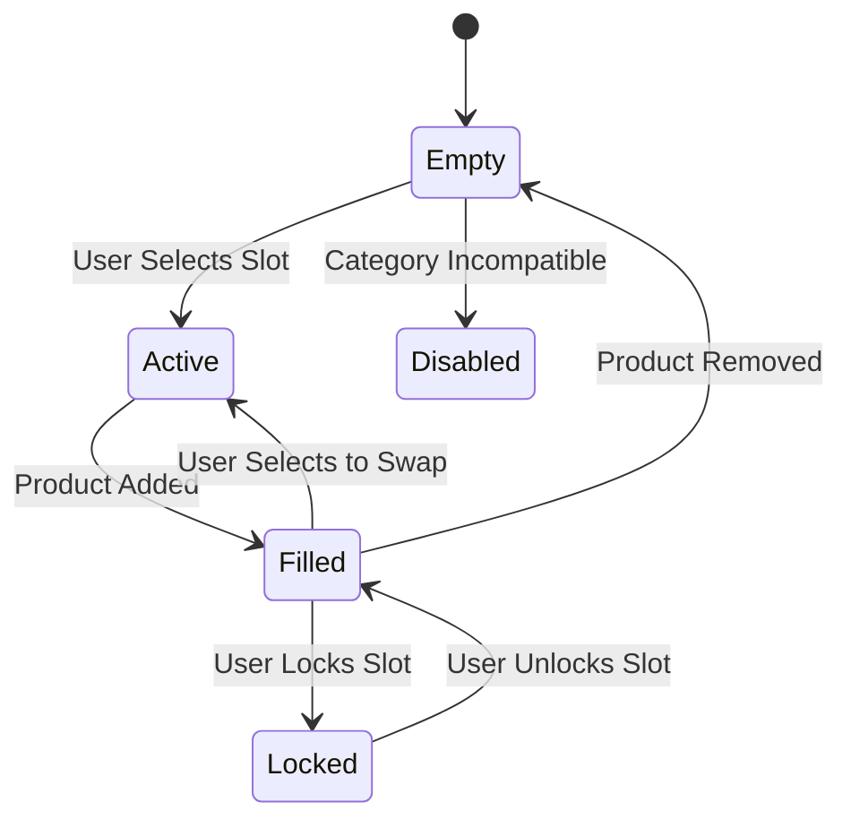

# FashXStudio — Production Build Visual Design — 10
## Outfit / Styling / Fashion Experience System Reference Manual

**Subsystem:** Screens / Pages / Visual Design  
**Phase:** Visual Design — 10 (Outfit / Styling / Fashion Experience System)  
**Status:** **LOCKED & VERIFIED PRODUCTION BASELINE**  
**Date:** 2026-10-02  
**Verification Baseline:** 964 tests passed (100% green)

---

### 1. Phase Objective

Transform FashXStudio from a platform that permits users to discover and inspect fashion into an interactive creative studio where users compose, customize, understand, save, and purchase complete looks and outfits (`ST01`–`ST09`).

Connecting the visual discovery and commerce layers:
$$\text{PRODUCT} \longrightarrow \text{STYLE} \longrightarrow \text{LOOK} \longrightarrow \mathbf{OUTFIT} \longrightarrow \mathbf{STYLING\ WORKSPACE} \longrightarrow \begin{cases} \text{Save / Collection Archive} \\ \text{Share / Moodboard Publishing} \\ \text{Authoritative Cart Handoff} \end{cases}$$

This phase builds upon:
* **VD-6 Fashion Content:** Content object models (`Product`, `Look`, `Outfit`, `Style`, `Collection`).
* **VD-7 Shopping UI:** Commerce transactional guarantees, availability integrity, and cart handoff.
* **VD-8 Discovery + Search:** Preserving search filters and facet history across styling transitions.
* **VD-9 Product & Fashion Detail:** Hotspot coordinates, garment specifications, and product variants.

---

### 2. Styling System Architecture & Flow Diagram (Section 10.1)

```
                         STYLING
                            │
          ┌─────────────────┼─────────────────┐
          ▼                 ▼                 ▼
      Discover           Create            Manage
          │                 │                 │
          ▼                 ▼                 ▼
        Looks         Outfit Builder      Saved Looks
        Styles        Look Builder        Preferences
        Products      Mix & Match
          │                 │
          └────────┬────────┘
                   ▼
              Style Engine
                   │
          ┌────────┼────────┐
          ▼        ▼        ▼
       Products  Rules    AI/Recommendations
          │        │        │
          └────────┼────────┘
                   ▼
              Outfit Preview
                   │
                   ▼
                Shopping
```

---

### 3. Styling Experience Principles (Section 10.3)

1. **Products Make Outfits:** An outfit is never an isolated abstract concept; it is an organized, wearable composition of real, purchasable garments.
2. **Outfits Express Styles:** A style is an aesthetic direction; a look is a specific visual expression; an outfit is a wearable combination.
3. **Composition Over Consumption:** Empower users to explore, iterate, swap, and personalize before committing to purchase.
4. **Transparent AI Styling:** AI styling suggestions clearly articulate *why* items work together (color harmony, silhouette proportion, weather appropriateness).
5. **Authoritative Cart Handoff:** Outfits validate inventory availability and real-time pricing before transferring constituent pieces into the commerce cart.
6. **Strict Contract Integrity:** All payloads enforce `extra="forbid"` via `BaseContractModel` (Constitution Rule I02).

---

### 4. Styling Screen Inventory: ST01–ST09 (Section 10.2)

| Screen ID | Screen Name | Template Contract | Primary Purpose |
| :--- | :--- | :--- | :--- |
| **ST01** | Style Home | `StyleHomeTemplateSpecContract` | Gateway to aesthetic trends, featured styles, and personal saved looks |
| **ST02** | Outfit Builder | `OutfitBuilderTemplateSpecContract` | Primary interactive canvas to assemble and customize wearable outfits |
| **ST03** | Look Builder | `LookBuilderTemplateSpecContract` | Creative editorial canvas with narrative moodboards and curated pieces |
| **ST04** | Mix & Match | `MixMatchTemplateSpecContract` | Rapid alternative experimentation matrix with single-tap slot swapping |
| **ST05** | Style Recommendation | `StyleRecommendationTemplateSpecContract` | Personalized aesthetic suggestions with transparent explainability rationale |
| **ST06** | Outfit Preview | `OutfitPreviewTemplateSpecContract` | Clean, non-editable composition preview with wardrobe price summary |
| **ST07** | Outfit Detail | `OutfitDetailTemplateSpecContract` | Comprehensive outfit canvas with shoppable pieces and similar looks |
| **ST08** | Saved Looks | `SavedLooksTemplateSpecContract` | User lookbook archive with collection tags, duplication, and filtering |
| **ST09** | Style Preferences | `StylePreferencesTemplateSpecContract` | Fine-grained aesthetic, fit, color, material, and budget profile manager |

---

### 5. Core Object Model (Sections 10.4, 10.60 – 10.63)

The styling system differentiates eight fundamental entity types:

$$\begin{aligned}
\text{Style} &\quad\text{Aesthetic theme, visual grammar, and cultural language.} \\
\text{Look} &\quad\text{Curated visual composition or editorial expression.} \\
\text{Outfit} &\quad\text{Wearable collection of items occupying assigned slots.} \\
\text{OutfitSlot} &\quad\text{Category position within an outfit (top, bottom, footwear, etc.).} \\
\text{OutfitItem} &\quad\text{Catalog product variant assigned to an outfit slot.} \\
\text{Recommendation} &\quad\text{Personalized style suggestion with explainability rationale.} \\
\text{StylePreference} &\quad\text{User aesthetic rules, preferred fits, colors, and budget tier.} \\
\text{SavedLook} &\quad\text{Persisted user creation with collection tag and timestamp.}
\end{aligned}$$

---

### 6. Configurable Slot Model (Section 10.11)

The outfit builder organizes garments into logical, structured wardrobe slots:

$$\text{SlotCategories} = \{\text{Outerwear}, \text{Top}, \text{Bottom}, \text{Footwear}, \text{Accessory}, \text{Bag}\}$$

Each slot defines:
* `id`: Unique slot identifier (e.g., `slot-top`, `slot-bottom`).
* `category`: Authoritative `SlotCategory` enum.
* `name`: User-facing localized category title (*Top*, *Trousers*, *Shoes*).
* `position`: Ordered rendering index (0 = Top, 1 = Outerwear, 2 = Bottom, etc.).
* `required`: Boolean flag indicating if slot must be filled for complete status.
* `item`: Assigned `OutfitItemContract` or `None`.
* `state`: Current `SlotState` lifecycle enum.

---

### 7. Slot Lifecycle & States (Section 10.12)

Individual slots transition across five deterministic states:



* **`empty`**: Dashed border container displaying `+ Add [Category]` trigger.
* **`filled`**: Garment thumbnail, brand, title, selected size/color, and price.
* **`active`**: Highlighted accent border indicating candidate replacement target.
* **`locked`**: Protected slot preserved across automated AI outfit regenerations.
* **`disabled`**: Slot greyed out when mutually exclusive with another garment.

---

### 8. Slot Mutation Operations (Sections 10.13 – 10.15)

The styling service exposes four authoritative slot mutations:

1. **Add Item (`POST /styling/builder/{outfit_id}/add`):**
   Assigns a product to a designated slot, populates variant attributes, recalculates total price, and evaluates completeness.
2. **Replace Item (`POST /styling/builder/{outfit_id}/replace`):**
   Swaps out existing slot occupant with an alternative candidate product.
3. **Remove Item (`DELETE /styling/builder/{outfit_id}/slot/{slot_id}`):**
   Clears designated slot, resets its state to `empty`, and subtracts price.
4. **Reset Slots (`POST /styling/builder/{outfit_id}/reset`):**
   Clears all slots, resetting outfit to clean baseline with zero cost.

---

### 9. Completeness & Pricing Calculation Engine (Sections 10.10, 10.61)

The styling engine deterministically evaluates completeness and total financial cost:

$$\text{TotalPrice} = \sum_{s \in \text{Slots},\, s.\text{item} \neq \text{None}} s.\text{item}.\text{price}$$

$$\text{IsComplete} = \forall s \in \text{Slots} \quad (s.\text{required} \implies s.\text{item} \neq \text{None})$$

An outfit is complete only when all required slots (`top`, `bottom`, `footwear`) are filled. Outerwear, bags, and accessories remain optional accents that enhance total price without blocking completion.

---

### 10. ST01: Style Home Gateway (Sections 10.5 & 10.6)

* **Hero Featured Aesthetic:** Banner highlighting seasonal trend (`Contemporary Streetwear`).
* **Trending Styles Rail:** Circular horizontal thumbnails linking to style subcategories.
* **Curated Looks Feed:** Grid of editorial look cards with item counts and author badges.
* **Quick Create CTA:** High-contrast `+ New Outfit` trigger opening Outfit Studio.
* **Recent Saved Looks:** Horizontal strip displaying user's recently saved outfits.

---

### 11. ST02: Interactive Outfit Builder Workspace (Sections 10.7 – 10.10)

* **Header Controls:** Style title, completion badge (`Complete` vs `3/6 Slots`), and `Reset` action.
* **Vertical Canvas Scroll:** Ordered list of `OutfitSlotView` components.
* **Sticky Action Sheet:** Bottom floating bar displaying total outfit cost, filled item count, and primary triggers:
  * `Mix & Match`: Opens ST04 experimentation matrix.
  * `Preview`: Launches ST06 read-only preview.
  * `Save`: Persists outfit to ST08 user lookbook.
  * `Shop Look`: Validates inventory and initiates commerce handoff.

---

### 12. ST03: Creative Visual & Editorial Look Builder (Sections 10.18 & 10.19)

* **Editorial Canvas:** Intended for fashion stylists, creators, and visual merchandisers.
* **Context Narrative:** Storytelling description articulating mood, silhouette balance, and fabric pairing.
* **Style Tags:** Interactive pill badges (`#ContemporaryStreetwear`, `#MonsoonHumidity`).
* **Curated Moodboard Grid:** Multi-column layout pairing garment photography with lifestyle visuals.

---

### 13. ST04: Mix & Match Rapid Experimentation Matrix (Sections 10.16 & 10.17)

* **Slot Candidate Rails:** Horizontal scroll strips grouped by slot category (Tops, Outerwear, Bottoms, Footwear).
* **Instant Candidate Swapping:** Tapping any candidate immediately replaces the slot's active item and updates pricing in real time.
* **Active Indicator:** Active garment displays a `✓ Active` badge to distinguish current selection from alternatives.

---

### 14. ST05: Explainable Style Recommendations (Sections 10.20 – 10.22)

* **Transparent Rationale:** Displays conversational, personalized justification:
  > *"Curated based on your explored preferences for French flax linen and boxy Japanese tailoring."*
* **Matching Looks & Products:** Surfaces complementary looks and individual catalog pieces aligned with user preferences.
* **AI Trust Boundary:** Algorithmic rationale is clearly flagged as recommendations, never as physical product facts.

---

### 15. ST06: Clean Read-Only Outfit Preview (Sections 10.23 & 10.24)

* **Minimalist Composition:** Clean presentation focusing on aesthetic harmony without edit controls.
* **Wardrobe Breakdown:** Stacked list of constituent pieces with high-res thumbnails, categories, titles, brands, and prices.
* **Direct Actions:** Dual footer triggers allowing instant transition to `Edit Outfit` or `Shop Complete Look`.

---

### 16. ST07: Comprehensive Outfit Detail (Sections 10.25 – 10.27)

* **Hero Outfit Photography:** Full-bleed styling photo showcasing total ensemble drape.
* **Constituent Products List:** Direct shoppable cards for every piece in the outfit.
* **Similar Outfits Rail:** Content-based recommendations suggesting alternative styling interpretations.
* **Real-Time Availability Banner:** Visual badge verifying stock status before checkout.

---

### 17. Pre-Purchase Availability Validation & Commerce Cart Transfer (Section 10.28)

Before transferring an outfit to the commerce shopping cart, the system executes authoritative validation:

$$\text{Validate}(\text{Outfit}) \longrightarrow \begin{cases}
\text{total\_items}: & \text{Count of filled slots} \\
\text{available\_items}: & \text{Count of in-stock items} \\
\text{can\_proceed\_to\_cart}: & \text{True iff at least 1 item is available} \\
\text{unavailable\_product\_ids}: & \text{List of out-of-stock garments}
\end{cases}$$

Upon validation, users can add the complete available ensemble to their cart with a single tap.

---

### 18. ST08 & ST09: Saved Looks & Style Preferences (Sections 10.29 – 10.35)

#### ST08 Saved Looks Management
* **Lookbook Archive:** User's personal collection of saved outfits.
* **Filter Tabs:** Categorized by `#all`, `#minimal`, `#streetwear`, `#formal`, and `#favorites`.
* **Actions:**
  * `Open in Builder`: Loads look into ST02 for editing.
  * `Clone`: Duplicates look into an independent editable copy (`Look Name (Copy)`).
  * `Delete`: Removes look from user registry with immediate UI reflection.

#### ST09 Style Preferences
* **Multi-Chip Selectors:** Preferred styles, body fit profiles, color palettes, and textile materials.
* **Budget Tier:** Selectable spending tiers (`budget`, `medium`, `premium`, `luxury`).
* **Bidirectional Sync:** Updates directly influence ST01 recommendations and ST05 AI styling models.

---

### 19. Mobile TypeScript Component & Template Architecture

Located under `mobile/features/visual/styling/`:

```
mobile/features/visual/styling/
├── types.ts                                  # Complete TypeScript interfaces mirroring Pydantic v2
├── components/
│   ├── OutfitSlotView.tsx                   # Individual slot renderer (empty, filled, active, locked)
│   ├── OutfitCanvas.tsx                     # Ordered slots canvas, header, and sticky summary bar
│   ├── MixMatchMatrix.tsx                   # Candidate product rails grouped by slot category
│   ├── SavedLookCard.tsx                    # Lookbook card with thumbnail collage and action buttons
│   └── StylePreferenceSelector.tsx          # Multi-chip preference selectors and budget tier picker
├── templates/
│   ├── StyleHomeTemplate.tsx                # ST01: Style Home entry screen
│   ├── OutfitBuilderTemplate.tsx            # ST02: Interactive outfit styling workspace
│   ├── LookBuilderTemplate.tsx              # ST03: Creative editorial look canvas
│   ├── MixMatchTemplate.tsx                 # ST04: Alternative experimentation matrix
│   ├── OutfitPreviewTemplate.tsx            # ST06: Read-only outfit composition preview
│   ├── OutfitDetailTemplate.tsx             # ST07: Comprehensive shoppable outfit canvas
│   ├── SavedLooksTemplate.tsx               # ST08: Saved looks collection manager
│   └── StylePreferencesTemplate.tsx         # ST09: User style profile customization screen
└── index.ts                                 # Public module barrel export
```

---

### 20. Verification, Automated Test Metrics & Completion Gate

```powershell
pytest tests/unit/test_visual_styling.py tests/integration/test_visual_styling_router.py -v
============================= 28 passed in 1.80s ==============================

pytest -q
============================ 964 passed in 14.71s =============================
```

* **Unit Tests (`tests/unit/test_visual_styling.py`):**
  * `STYLE-001`–`STYLE-010`: ST01 Style Home & ST02 Outfit Builder Canvas.
  * `STYLE-011`–`STYLE-020`: Slot Mutations, Completeness & Pricing Calculation.
  * `STYLE-021`–`STYLE-030`: ST03 Look Builder & ST04 Mix & Match Matrix.
  * `STYLE-031`–`STYLE-040`: ST05 Recommendations & ST06 Outfit Preview.
  * `STYLE-041`–`STYLE-050`: ST07 Outfit Detail & Commerce Availability Validation.
  * `STYLE-051`–`STYLE-056`: ST08 Saved Looks & ST09 Style Preferences.
  * `extra="forbid"` strict contract validation (Rule I02).
* **Integration Tests (`tests/integration/test_visual_styling_router.py`):**
  * 18 REST endpoints under `/api/v1/visual/styling/*`.
  * 5 Core End-to-End User Flows:
    1. Product Detail $\to$ Add to Outfit Slot.
    2. Discovery Look $\to$ Look Builder Canvas.
    3. Outfit Builder $\to$ Persist to Saved Looks.
    4. Outfit Builder $\to$ Validate Stock $\to$ Shopping Cart Handoff.
    5. AI Recommendation $\to$ Adopt Product into Outfit Slot.
* **Total Repository Test Baseline:** **964 / 964 passing (100% green, 0 failures, 0 regressions)**.

```
==============================================================================
FASHXSTUDIO VISUAL DESIGN — PHASE 10: COMPLETION GATE
==============================================================================
[✓] ST01 - ST09 Styling Screen Contracts & Templates                          LOCKED
[✓] Configurable Slot Architecture (Top, Bottom, Footwear, Outerwear, etc.)    LOCKED
[✓] Slot Lifecycle Engine (Empty, Filled, Active, Locked, Disabled)           LOCKED
[✓] Slot Mutations (Add, Replace, Remove, Reset) Deterministic State Machine   LOCKED
[✓] Wearability Completeness Engine & Dynamic Price Aggregator                LOCKED
[✓] ST04 Mix & Match Matrix with Instant Single-Tap Candidate Swapping        LOCKED
[✓] ST05 Explainable Style Recommendations & Transparent AI Trust Boundary    LOCKED
[✓] ST08 Saved Looks Management (Cloning, Filtering, Deleting)                LOCKED
[✓] ST09 User Aesthetic & Budget Preferences Customization                    LOCKED
[✓] Pre-Purchase Stock Availability Validation & Shopping Cart Transfer       LOCKED
[✓] Mobile TypeScript UI Components & Templates (React Native / Expo SDK 57)  LOCKED
[✓] FastAPI REST Endpoints (/visual/styling/*)                                LOCKED
[✓] Pydantic v2 BaseContractModel Schemas (extra="forbid" everywhere)         LOCKED
[✓] Automated Tests (28 new tests, 964 / 964 total passing)                   PASSED
==============================================================================
STATUS: PHASE 10 (OUTFIT / STYLING / FASHION EXPERIENCE) COMPLETED & VERIFIED
==============================================================================
```
