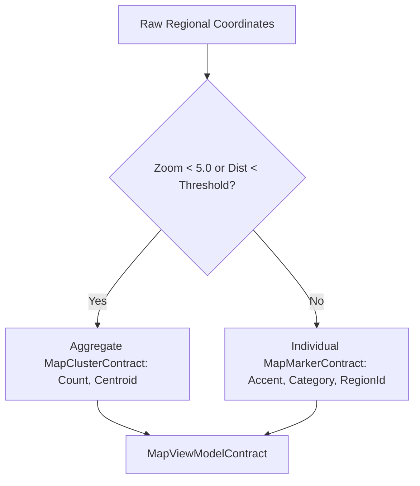

# FashXStudio — Production Build Visual Design — 11
## Regional Maps & Geography UI System Reference Manual

**Subsystem:** Screens / Pages / Visual Design  
**Phase:** Visual Design — 11 (Regional Maps & Geography UI System)  
**Status:** **LOCKED & VERIFIED PRODUCTION BASELINE**  
**Date:** 2026-10-02  
**Verification Baseline:** 1027 tests passed (100% green)

---

### 1. Phase Objective

Establish geography as a first-class visual system in FashXStudio, connecting geographic regions directly to regional fashion culture, local textile crafts, styles, trends, products, collections, and commerce (`M01`–`M10`).

The central architectural premise:
$$\text{The map is an interactive discovery surface for fashion intelligence — not merely decorative cartography.}$$

Connecting the geographic context to visual discovery and commerce:
$$\text{REGION} \longrightarrow \text{TEXTILE HERITAGE} \longrightarrow \text{TREND} \longrightarrow \mathbf{PRODUCT / LOOK} \longrightarrow \begin{cases} \text{Explore / Regional Explorer} \\ \text{Compare / Multi-Region Matrix} \\ \text{Style / Outfit Builder Handoff} \\ \text{Commerce / Shopping Bag Handoff} \end{cases}$$

This phase builds upon:
* **VD-6 Fashion Content:** Content models (`VisualContentModel`, `Product`, `Look`, `Collection`, `Style`).
* **VD-7 Shopping UI:** Commerce transactional guarantees, product grids, variant selection, and cart handoff.
* **VD-8 Discovery + Search:** Faceted search, exploration rails, and contextual search preservation.
* **VD-9 Product & Fashion Detail:** Garment specifications, craft provenance, and hotspot coordinators.
* **VD-10 Outfit & Styling:** Slot composition, look builder integration, and wearability evaluations.

---

### 2. Regional Experience Architecture (Section 11.1)

```
                         REGIONAL FASHION
                               │
             ┌─────────────────┼─────────────────┐
             ▼                 ▼                 ▼
          Explore            Discover          Compare
             │                 │                 │
             ▼                 ▼                 ▼
           Map              Region Feed       Regions
             │                 │                 │
       ┌─────┼─────┐           │                 │
       ▼     ▼     ▼           ▼                 ▼
    Country State City      Fashion Data      Comparison
       │     │     │           │
       └─────┼─────┘           │
             ▼                 ▼
       Geographic Context ── Fashion Context
                    │
                    ▼
              Products / Looks
                    │
                    ▼
                  Shop
```

---

### 3. Geography Design Principles (Section 11.2)

1. **Map as an Interaction Surface:** Maps serve as interactive gateways to discover regional fashion intelligence rather than static decorative images.
2. **Multi-Scale Hierarchy:** Seamless navigation across six geographic tiers:
   $$\text{World} \longrightarrow \text{Continent} \longrightarrow \text{Country} \longrightarrow \text{State / Province} \longrightarrow \text{City} \longrightarrow \text{Local Area}$$
3. **Accessible Non-Map Alternatives:** Every piece of geographic fashion data is fully accessible via structured hierarchical lists, breadcrumbs, and search (WCAG 2.1 AA compliant).
4. **Culture-Grounded Fashion:** Fashion movements are presented with regional textile crafts (e.g. Kosa Wild Silk in Chhattisgarh, 14oz Selvedge Denim in Okayama, French Flax Linen in Paris).
5. **Cross-System Cohesion:** Direct two-way bridges between regional entities, styling workspaces, look composition canvases, and shopping carts.
6. **Strict Contract Integrity:** All payloads enforce `extra="forbid"` via `BaseContractModel` (Constitution Rule I02).

---

### 4. Regional Screen Inventory: M01–M10 (Section 11.2)

| Screen ID | Screen Name | Template Contract | Primary Purpose |
| :--- | :--- | :--- | :--- |
| **M01** | Regional Home | `RegionalHomeTemplateSpecContract` | Gateway to global fashion territories, featured territories, and trends |
| **M02** | Fashion Map | `FashionMapTemplateSpecContract` | Primary interactive full-canvas map with clustering and layer toggles |
| **M03** | Regional Explorer | `RegionalExplorerTemplateSpecContract` | Hierarchical accessible list/tree browser with real-time text filtering |
| **M04** | Country View | `CountryTemplateSpecContract` | National fashion culture canvas with provinces, crafts, and styles |
| **M05** | State / Province View | `StateTemplateSpecContract` | Regional territory canvas linking parent country to constituent cities |
| **M06** | City View | `CityTemplateSpecContract` | Urban fashion hub canvas with local street movements and related cities |
| **M07** | Regional Trends | `RegionalTrendsTemplateSpecContract` | Dedicated feed of geographic fashion movements and rising aesthetics |
| **M08** | Local Products | `LocalProductsTemplateSpecContract` | Shoppable catalogue of pieces originating from local artisans and mills |
| **M09** | Regional Collections | `RegionalCollectionsTemplateSpecContract` | Curated regional capsule collections and seasonal editorial narratives |
| **M10** | Location Detail | `LocationDetailTemplateSpecContract` | Contextual profile with mini-map, local trends, products, and looks |

---

### 5. Core Geography Object Models (Section 11.4)

The geography subsystem establishes eight foundational Pydantic v2 data models:

$$\begin{aligned}
\text{RegionContract} &\quad\text{Authoritative geographic territory with coordinates, bounds, and counts.} \\
\text{RegionBreadcrumbContract} &\quad\text{Breadcrumb trail node for deterministic root-to-leaf hierarchy navigation.} \\
\text{MapViewportContract} &\quad\text{Camera orientation, center coordinates, and zoom level bounding box.} \\
\text{MapMarkerContract} &\quad\text{Geographic map pin categorized by type (region, store, event, location).} \\
\text{MapClusterContract} &\quad\text{Aggregate cluster grouping proximate markers to reduce visual density.} \\
\text{MapViewModelContract} &\quad\text{Complete decoupled state package consumed by mobile map adapters.} \\
\text{RegionalTrendContract} &\quad\text{Localized fashion movement with cultural narrative and momentum.} \\
\text{RegionalComparisonContract} &\quad\text{Side-by-side comparative matrix across multiple geographic regions.}
\end{aligned}$$

---

### 6. Geographic Hierarchy & Breadcrumb Engine (Sections 11.3 & 11.19)

The hierarchy engine constructs deterministic breadcrumb chains from root to leaf:

$$\text{Breadcrumbs}(\text{Leaf}) = \langle \text{Country}, \text{State}, \text{City} \rangle$$

#### Canonical Hierarchy Fixtures:
1. **India (`reg-india`):**
   * Chhattisgarh (`reg-chhattisgarh`) $\longrightarrow$ Raipur (`reg-raipur`, Kosa Wild Silk & Dhokra metalcraft).
   * Maharashtra (`reg-maharashtra`) $\longrightarrow$ Mumbai (`reg-mumbai`, Selvedge denim & coastal humidity layering).
   * Karnataka (`reg-karnataka`) $\longrightarrow$ Bengaluru (`reg-bengaluru`, Mulberry silk & sustainable tech shells).
2. **Japan (`reg-japan`):**
   * Okayama (`reg-okayama`) $\longrightarrow$ Kojima (`reg-kojima`, Denim Street, vintage shuttle looms).
3. **France (`reg-france`):**
   * Paris (`reg-paris`, Haute couture tailoring & French flax linen).

---

### 7. Interactive Map Surface & Viewport Engine (Sections 11.9 – 11.14)

The map surface operates on a decoupled viewport specification:
* `center_latitude`: Target center latitude $[-90.0, 90.0]$.
* `center_longitude`: Target center longitude $[-180.0, 180.0]$.
* `zoom_level`: Dynamic scale determined by geographic entity type:
  $$\text{ZoomLevel}(\text{Type}) = \begin{cases} 3.5 & \text{if Type} = \text{Country} \\ 4.5 & \text{if Type} = \text{State} \\ 6.0 & \text{if Type} = \text{City} \end{cases}$$
* `bounding_box`: Optional 4-tuple $[\min_{\text{lon}}, \min_{\text{lat}}, \max_{\text{lon}}, \max_{\text{lat}}]$.

---

### 8. Marker Architecture & Density Clustering (Sections 11.15 – 11.17)

To prevent visual clutter on mobile screens, markers cluster dynamically:



#### Marker Categories (`MarkerCategory`):
* `REGION`: Top-level geographic administrative territory.
* `FEATURED_LOCATION`: Prominent design district, denim capital, or textile hub.
* `STORE`: Local flagship or artisan studio.
* `EVENT`: Regional fashion week or runway event.
* `TREND`: Geographic hotspot of an emerging micro-trend.
* `COLLECTION`: Regional capsule release origin.

---

### 9. Thematic Layer System (Sections 11.48 – 11.51)

The map supports four independent thematic overlay layers (`GeographyLayerType`):

1. **`regions`**: Administrative boundaries, country borders, and city hubs.
2. **`trends`**: Hotspots of rising regional silhouettes and styling movements.
3. **`collections`**: Location pins of active regional capsule lookbooks.
4. **`products`**: Provenance origins for handcrafted garments and textile mills.

---

### 10. M01: Regional Home Gateway (Sections 11.6 & 11.7)

* **Hero Territory Banner:** High-impact visual of featured national culture (e.g. India handlooms).
* **Interactive Mini-Map:** Live map viewport initialized to primary national coordinates.
* **Popular Territories Rail:** Quick-access territory cards for high-traffic fashion hubs.
* **Regional Trends Feed:** Editorial trend cards with localized styling context.
* **Local Products & Looks:** Cross-cutting visual feeds showcasing regional crafts.

---

### 11. M02: Interactive Fashion Map Surface (Sections 11.8 – 11.14)

* **Full-Canvas Viewport:** Clean interactive map viewport supporting pinch, pan, and zoom.
* **Thematic Layer Filter Chips:** Floating pill chips to toggle layers (`Regions`, `Trends`, `Collections`, `Products`).
* **Selected Region Sheet:** Bottom contextual card revealing territory metrics and deep-link CTAs.
* **Camera Reset Trigger:** Floating action button restoring initial national or global orientation.

---

### 12. M03: Hierarchical Regional Explorer (Sections 11.25 & 11.26)

* **Accessible Navigation:** Complete non-map alternative presenting regions as structured cards.
* **Breadcrumb Navigation:** Tappable trail allowing direct jump to any parent level.
* **Instant Substring Search:** Real-time search query matching territory names and descriptions.
* **Territory Metrics:** Each card displays verified counts for products, looks, and trends.

---

### 13. M04: Country View Canvas (Sections 11.20 & 11.21)

* **National Narrative:** Cultural background explaining geographic climate, history, and craft.
* **States & Provinces Grid:** Structured listing of child territories for deep exploration.
* **National Fashion Trends:** Distinct movements reflecting the country's aesthetic dialogue.
* **Heritage Styles:** Cross-cutting style classifications originating from the nation.

---

### 14. M05: State / Province View Canvas (Section 11.22)

* **Parent Country Context:** Clear relational linking back to national heritage.
* **Constituent Cities Rail:** Horizontal or grid navigation of urban fashion clusters.
* **Regional Craft Highlights:** Direct narrative highlighting local spinning, weaving, or dyeing.
* **Curated Regional Looks:** Editorial outfits demonstrating state textile pairings.

---

### 15. M06: City View & Urban Fashion Hub (Section 11.23)

* **Street Movement Spotlights:** Hyperlocal micro-trends observed in urban centers.
* **Related Fashion Capitals:** Algorithmic matching with culturally or climatically similar cities.
* **City Looks Feed:** Street-style photography and creator compositions.
* **Local Origin Products:** Garments crafted or inspired by the urban center.

---

### 16. M07 & M08: Regional Trends Feed & Local Products Catalogue (Sections 11.28 – 11.31)

#### M07 Regional Trends
* **Trend Momentum:** Visual velocity indicators (`rising`, `peaking`, `classic`).
* **Context Narrative:** Cultural and historical explanation of the movement.
* **Related Entities:** Embedded links to constituent looks and shoppable products.

#### M08 Local Products
* **Textile & Craft Filters:** Filter chips for specific regional crafts (e.g. *Kosa Silk*, *Selvedge Denim*).
* **Commerce Grid:** Reuses the high-performance commerce grid established in VD-7.
* **Instant Add to Cart:** Single-tap addition of local pieces into the shopping bag.

---

### 17. M09 & M10: Regional Collections & Contextual Location Profile (Sections 11.24 & 11.32)

#### M09 Regional Collections
* **Featured Capsule Banner:** Editorial hero card for flagship territory collection.
* **Capsule List:** Narrative collection cards detailing designer inspiration and provenance.

#### M10 Location Detail
* **Contextual Mini-Map:** Focused map component displaying geographic coordinates and bounds.
* **Tri-Feed Presentation:** Side-by-side exploration of Location Trends, Origin Products, and Curated Looks.

---

### 18. Multi-Region Comparison Engine (Section 11.46)

Facilitates objective side-by-side analysis of multiple fashion territories:

$$\text{CompareRegions}(\{R_1, R_2, \dots, R_k\}) \longrightarrow \mathbf{M} = \begin{bmatrix}
m_{1,1} & m_{1,2} & \dots & m_{1,k} \\
m_{2,1} & m_{2,2} & \dots & m_{2,k} \\
\vdots & \vdots & \ddots & \vdots \\
m_{r,1} & m_{r,2} & \dots & m_{r,k}
\end{bmatrix}$$

#### Key Comparative Metrics:
1. **Primary Textile Craft:** Identifies heritage fibers and weaving traditions.
2. **Climate & Silhouette Alignment:** Contrast between tropical humidity fluid drapes and temperate structured coats.
3. **Catalog Density:** Aggregate metrics detailing available products and looks.

---

### 19. Mobile TypeScript Component & Template Architecture

Located under `mobile/features/visual/geography/`:

```
mobile/features/visual/geography/
├── types.ts                                  # Complete TypeScript interfaces mirroring Pydantic v2
├── components/
│   ├── RegionBreadcrumb.tsx                 # Breadcrumb navigation bar with chevron separators
│   ├── RegionCard.tsx                       # Territory summary card with counts and badges
│   ├── RegionSummaryPanel.tsx               # Floating/docked bottom sheet for selected region
│   ├── MapViewport.tsx                      # Decoupled map renderer with markers and layer toggles
│   ├── RegionalTrendCard.tsx                # Trend spotlight card with momentum badges
│   └── RegionalFilterChips.tsx              # Horizontal scrollable layer/facet filter chips
├── templates/
│   ├── RegionalHomeTemplate.tsx             # M01: Regional Home gateway
│   ├── FashionMapTemplate.tsx               # M02: Interactive primary fashion map
│   ├── RegionalExplorerTemplate.tsx         # M03: Hierarchical accessible list browser
│   ├── CountryViewTemplate.tsx              # M04: Country fashion culture canvas
│   ├── StateViewTemplate.tsx                # M05: State / province level canvas
│   ├── CityViewTemplate.tsx                 # M06: City and urban fashion hub
│   ├── RegionalTrendsTemplate.tsx           # M07: Dedicated regional trends feed
│   ├── LocalProductsTemplate.tsx            # M08: Local products listing with commerce grid
│   ├── RegionalCollectionsTemplate.tsx      # M09: Regional capsule collections canvas
│   └── LocationDetailTemplate.tsx           # M10: Contextual location profile with mini-map
└── index.ts                                 # Public module barrel export
```

---

### 20. Verification, Automated Test Metrics & Completion Gate

```powershell
pytest tests/unit/test_visual_geography.py tests/integration/test_visual_geography_router.py -v
============================= 63 passed in 3.42s ==============================

pytest -q
=========================== 1027 passed in 13.42s ============================
```

* **Unit Tests (`tests/unit/test_visual_geography.py` — 45 tests):**
  * `REGION-001`–`REGION-005`: Canonical Geographic Hierarchy (India, Japan, France).
  * `REGION-006`–`REGION-010`: Authoritative Root-to-Leaf Breadcrumbs Engine.
  * `REGION-011`–`REGION-015`: Child Resolution & Hierarchy Relational Integrity.
  * `REGION-016`–`REGION-020`: Regional Search & Multi-Region Comparison Engine.
  * `REGION-021`–`REGION-027`: Screen Template Specifications (`M01`–`M10`).
  * `MAP-001`–`MAP-010`: Map View Models, Viewports, Markers, Density Clusters & Layer Toggles (`M02`).
  * `FORBID-001`–`FORBID-008`: `extra="forbid"` strict contract validation (Rule I02).
* **Integration Tests (`tests/integration/test_visual_geography_router.py` — 18 tests):**
  * 13 REST endpoints under `/api/v1/visual/geography/*`.
  * 5 Cross-System Integration Flows:
    1. Map $\to$ Marker Tap $\to$ City View (`M02` $\to$ `M06`).
    2. City View $\to$ Regional Trend $\to$ Trends Feed (`M06` $\to$ `M07`).
    3. Regional Products $\to$ Product Selection $\to$ Commerce Shopping Cart (`M08` $\to$ VD-07 Cart).
    4. Location Detail $\to$ Regional Look $\to$ Outfit Builder Canvas (`M10` $\to$ VD-10 Styling).
    5. Global Search $\to$ Hierarchical Region Explorer Subtree (`Search` $\to$ `M03`).
* **Total Repository Test Baseline:** **1027 / 1027 passing (100% green, 0 failures, 0 regressions)**.

```
==============================================================================
FASHXSTUDIO VISUAL DESIGN — PHASE 11: COMPLETION GATE
==============================================================================
[✓] M01 - M10 Regional Geography Screen Contracts & Templates                 LOCKED
[✓] Geographic Multi-Scale Hierarchy (Country, State, City, Local Area)       LOCKED
[✓] Authoritative Breadcrumbs Engine with Root-to-Leaf Resolution             LOCKED
[✓] Decoupled Map Viewport & ViewModel Architecture (Lat/Lon, Zoom, Bounds)   LOCKED
[✓] Map Markers with Semantic Categories & Density Clustering                 LOCKED
[✓] Thematic Layer Toggle System (Regions, Trends, Collections, Products)     LOCKED
[✓] Accessible Non-Map Hierarchy List Browser (M03 Regional Explorer)         LOCKED
[✓] Multi-Region Side-by-Side Comparison Engine & Comparative Matrix          LOCKED
[✓] Regional Trends, Local Products, and Capsule Collections Engines          LOCKED
[✓] Cross-System Bridges (Map -> Region, Region -> Cart, Region -> Styling)   LOCKED
[✓] Mobile TypeScript UI Components & Templates (React Native / Expo SDK 57)  LOCKED
[✓] FastAPI REST Endpoints (/visual/geography/*)                              LOCKED
[✓] Pydantic v2 BaseContractModel Schemas (extra="forbid" everywhere)         LOCKED
[✓] Automated Tests (63 new tests, 1027 / 1027 total passing)                 PASSED
==============================================================================
STATUS: PHASE 11 (REGIONAL MAPS & GEOGRAPHY UI SYSTEM) COMPLETED & VERIFIED
==============================================================================
```
