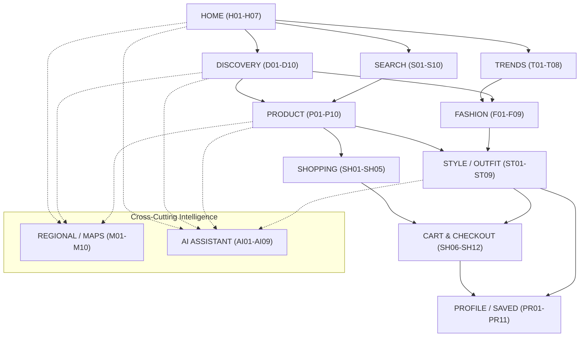

# FashXStudio — Production Build Visual Design — 1
## Visual Product Architecture + Complete Screen / Page Inventory

**Subsystem:** Screens / Pages / Visual Design  
**Phase:** Visual Design — 1 (Production Blueprint)  
**Status:** **COMPLETE & LOCKED BLUEPRINT**  
**Date:** 2026-09-28  
**Scope:** Canonical 123-Screen Inventory across 13 Experience Domains, 11 Reusable Page Templates, and 5 Implementation Dependency Groups.  

---

### 1.1 — Visual Product Architecture

FashXStudio's visual layer is organized into **8 Core Experience Domains** unified under a shared global application shell:

```
                         FASHXSTUDIO UI
                               │
          ┌────────────────────┼────────────────────┐
          │                    │                    │
      DISCOVER              CREATE              SHOP
          │                    │                    │
     Search/Explore       Outfit/Style         Products/Cart
          │                    │                    │
          └──────────────┬─────┴──────┬────────────┘
                         │            │
                    INTELLIGENCE   CONTENT
                         │            │
                    AI / Trends    Fashion Media
                         │            │
                 ┌───────┴────────────┴───────┐
                 │                             │
              REGIONAL                    PERSONAL
                 │                             │
             Maps/Places                Profile/Saves
                 │                             │
                 └──────────────┬──────────────┘
                                │
                         GLOBAL PLATFORM
```

---

### 1.2 — Primary Experience Domains

| Domain | Scope & Purpose |
| :--- | :--- |
| **Home** | Product entry point and personalized dynamic overview. |
| **Discovery** | Serendipitous exploration of fashion, products, styles, and collections. |
| **Search** | Multi-attribute search across products, brands, styles, and trends. |
| **Fashion** | Editorial media, lookbooks, designer stories, and inspiration. |
| **Shopping** | Commerce workflows: categories, cart, wishlist, checkout handoff, orders. |
| **Create / Style** | Freeform 2D outfit builder, mix-and-match matrix, and styling studio. |
| **Trends** | Macro and micro trend signals, popularity curves, and timelines. |
| **Maps / Regional** | Geography-aware fashion discovery, local artisans, and city cluster maps. |
| **AI** | Conversational stylist, item suitability assistant, and result explainers. |
| **Profile** | User style identity, fit preferences, saved wardrobes, and account settings. |
| **Platform** | Public landing, authentication, onboarding wizard, and location setup. |
| **System** | 404, 403, 500, offline cache, loading shimmers, and error recovery states. |

---

### 1.3 — Global Application Shell

#### Desktop Web / Tablet Landscape Layout
```text
┌──────────────────────────────────────────────────────────────┐
│ FashXStudio │ Search                         │ Alerts │ User │
├──────────────┬───────────────────────────────────────────────┤
│              │                                               │
│ Home         │                                               │
│ Discover     │                                               │
│ Fashion      │                PAGE CONTENT                   │
│ Shopping     │                                               │
│ Style        │                                               │
│ Trends       │                                               │
│ Maps         │                                               │
│ AI           │                                               │
│ Saved        │                                               │
│ Profile      │                                               │
│              │                                               │
└──────────────┴───────────────────────────────────────────────┘
```

#### Mobile App Layout (Expo SDK 57 / React Native 0.86)
```text
┌──────────────────────────────┐
│ Logo       Search     User   │
├──────────────────────────────┤
│                              │
│        PAGE CONTENT          │
│                              │
├──────────────────────────────┤
│ Home Discover Style Saved    │
└──────────────────────────────┘
```

---

### 1.4 — Complete Screen Inventory (123 Screens)

#### A. Platform / Entry Screens (8 Screens) — Group A: Foundation
* `A01` — **Landing**: `/landing` | Template: `Editorial` | Feature: `FX-F01`
* `A02` — **Sign In**: `/auth/signin` | Template: `Settings` | Feature: `FX-F02`
* `A03` — **Sign Up**: `/auth/signup` | Template: `Settings` | Feature: `FX-F02`
* `A04` — **Account Recovery**: `/auth/recovery` | Template: `Settings` | Feature: `FX-F02`
* `A05` — **Verification**: `/auth/verify` | Template: `Settings` | Feature: `FX-F02`
* `A06` — **Onboarding**: `/onboarding` | Template: `Assistant` | Feature: `FX-F02`
* `A07` — **Preference Setup**: `/onboarding/preferences` | Template: `Settings` | Feature: `FX-F02`
* `A08` — **Location / Region Setup**: `/onboarding/location` | Template: `Settings` | Feature: `FX-F12`

#### H. Home Screens (7 Screens) — Group B: Core Content
* `H01` — **Home Dashboard**: `/(tabs)/home` | Template: `Dashboard` | Feature: `FX-F03`
* `H02` — **Personalized Home**: `/home/personalized` | Template: `Dashboard` | Feature: `FX-F09`
* `H03` — **Trending Highlights**: `/home/trending` | Template: `Discovery` | Feature: `FX-F03`
* `H04` — **Recommended Products**: `/home/recommended-products` | Template: `Listing` | Feature: `FX-F03`
* `H05` — **Recommended Looks**: `/home/recommended-looks` | Template: `Listing` | Feature: `FX-F07`
* `H06` — **Regional Highlights**: `/home/regional-highlights` | Template: `Discovery` | Feature: `FX-F12`
* `H07` — **Recently Viewed**: `/home/recently-viewed` | Template: `Listing` | Feature: `FX-F05`

#### D. Discovery Screens (10 Screens) — Group B: Core Content
* `D01` — **Discovery Home**: `/(tabs)/discover` | Template: `Discovery` | Feature: `FX-F03`
* `D02` — **Explore Fashion**: `/discover/fashion` | Template: `Discovery` | Feature: `FX-F03`
* `D03` — **Explore Products**: `/discover/products` | Template: `Listing` | Feature: `FX-F05`
* `D04` — **Explore Looks**: `/discover/looks` | Template: `Listing` | Feature: `FX-F07`
* `D05` — **Explore Collections**: `/discover/collections` | Template: `Listing` | Feature: `FX-F06`
* `D06` — **Explore Brands**: `/discover/brands` | Template: `Listing` | Feature: `FX-F03`
* `D07` — **Explore Styles**: `/discover/styles` | Template: `Listing` | Feature: `FX-F03`
* `D08` — **Explore Trends**: `/discover/trends` | Template: `Discovery` | Feature: `FX-F08`
* `D09` — **Personalized Discovery**: `/discover/personalized` | Template: `Discovery` | Feature: `FX-F09`
* `D10` — **Discovery Results**: `/discover/results` | Template: `Listing` | Feature: `FX-F03`

#### S. Search Screens (10 Screens) — Group B: Core Content
* `S01` — **Search Home**: `/(tabs)/search` | Template: `Discovery` | Feature: `FX-F04`
* `S02` — **Search Suggestions**: `/search/suggestions` | Template: `Listing` | Feature: `FX-F04`
* `S03` — **Product Search Results**: `/search/products` | Template: `Listing` | Feature: `FX-F04`
* `S04` — **Fashion Search Results**: `/search/fashion` | Template: `Listing` | Feature: `FX-F04`
* `S05` — **Brand Search Results**: `/search/brands` | Template: `Listing` | Feature: `FX-F04`
* `S06` — **Style Search Results**: `/search/styles` | Template: `Listing` | Feature: `FX-F04`
* `S07` — **Trend Search Results**: `/search/trends` | Template: `Listing` | Feature: `FX-F04`
* `S08` — **Search Filters**: `/search/filters` | Template: `Settings` | Feature: `FX-F04`
* `S09` — **Advanced Search**: `/search/advanced` | Template: `Discovery` | Feature: `FX-F04`
* `S10` — **Search Empty State**: `/search/empty` | Template: `Discovery` | Feature: `FX-F04`

#### P. Product Screens (10 Screens) — Group B: Core Content
* `P01` — **Product Listing**: `/products` | Template: `Listing` | Feature: `FX-F05`
* `P02` — **Product Detail**: `/products/:id` | Template: `Detail` | Feature: `FX-F05`
* `P03` — **Product Image Gallery**: `/products/:id/gallery` | Template: `Detail` | Feature: `FX-F05`
* `P04` — **Product Variant Selection**: `/products/:id/variants` | Template: `Settings` | Feature: `FX-F05`
* `P05` — **Product Reviews**: `/products/:id/reviews` | Template: `Detail` | Feature: `FX-F05`
* `P06` — **Product Specifications**: `/products/:id/specifications` | Template: `Detail` | Feature: `FX-F05`
* `P07` — **Similar Products**: `/products/:id/similar` | Template: `Listing` | Feature: `FX-F05`
* `P08` — **Recommended Products**: `/products/:id/recommended` | Template: `Listing` | Feature: `FX-F05`
* `P09` — **Product Comparison**: `/products/compare` | Template: `Comparison` | Feature: `FX-F10`
* `P10` — **Product Availability**: `/products/:id/availability` | Template: `Detail` | Feature: `FX-F05`

#### SH. Shopping Screens (12 Screens) — Group C: Advanced Experiences
* `SH01` — **Shopping Home**: `/shopping` | Template: `Dashboard` | Feature: `FX-F11`
* `SH02` — **Category**: `/shopping/category/:id` | Template: `Listing` | Feature: `FX-F11`
* `SH03` — **Filter**: `/shopping/filter` | Template: `Settings` | Feature: `FX-F11`
* `SH04` — **Sort**: `/shopping/sort` | Template: `Settings` | Feature: `FX-F11`
* `SH05` — **Wishlist**: `/shopping/wishlist` | Template: `Listing` | Feature: `FX-F10`
* `SH06` — **Cart**: `/shopping/cart` | Template: `Checkout` | Feature: `FX-F11`
* `SH07` — **Cart Detail**: `/shopping/cart/detail` | Template: `Checkout` | Feature: `FX-F11`
* `SH08` — **Checkout**: `/shopping/checkout` | Template: `Checkout` | Feature: `FX-F11`
* `SH09` — **Order Review**: `/shopping/order-review` | Template: `Checkout` | Feature: `FX-F11`
* `SH10` — **Order Confirmation**: `/shopping/order-confirmation` | Template: `Detail` | Feature: `FX-F11`
* `SH11` — **Orders**: `/shopping/orders` | Template: `Listing` | Feature: `FX-F11`
* `SH12` — **Order Detail**: `/shopping/orders/:id` | Template: `Detail` | Feature: `FX-F11`

#### F. Fashion Content Screens (9 Screens) — Group B: Core Content
* `F01` — **Fashion Home**: `/fashion` | Template: `Editorial` | Feature: `FX-F06`
* `F02` — **Fashion Feed**: `/fashion/feed` | Template: `Editorial` | Feature: `FX-F06`
* `F03` — **Fashion Story**: `/fashion/stories/:id` | Template: `Editorial` | Feature: `FX-F06`
* `F04` — **Fashion Article**: `/fashion/articles/:id` | Template: `Editorial` | Feature: `FX-F06`
* `F05` — **Fashion Collection**: `/fashion/collections/:id` | Template: `Editorial` | Feature: `FX-F06`
* `F06` — **Fashion Look**: `/fashion/looks/:id` | Template: `Detail` | Feature: `FX-F06`
* `F07` — **Fashion Inspiration**: `/fashion/inspiration` | Template: `Discovery` | Feature: `FX-F06`
* `F08` — **Brand Story**: `/fashion/brands/:id/story` | Template: `Editorial` | Feature: `FX-F06`
* `F09` — **Editorial View**: `/fashion/editorial/:id` | Template: `Editorial` | Feature: `FX-F06`

#### ST. Outfit / Styling Screens (9 Screens) — Group C: Advanced Experiences
* `ST01` — **Style Home**: `/(tabs)/style` | Template: `Dashboard` | Feature: `FX-F07`
* `ST02` — **Outfit Builder**: `/style/builder` | Template: `Builder` | Feature: `FX-F07`
* `ST03` — **Look Builder**: `/style/look-builder` | Template: `Builder` | Feature: `FX-F07`
* `ST04` — **Mix & Match**: `/style/mix-match` | Template: `Builder` | Feature: `FX-F07`
* `ST05` — **Style Recommendation**: `/style/recommendations` | Template: `Discovery` | Feature: `FX-F08`
* `ST06` — **Outfit Preview**: `/style/preview/:id` | Template: `Detail` | Feature: `FX-F07`
* `ST07` — **Outfit Detail**: `/style/outfits/:id` | Template: `Detail` | Feature: `FX-F07`
* `ST08` — **Saved Looks**: `/style/saved-looks` | Template: `Listing` | Feature: `FX-F10`
* `ST09` — **Style Preferences**: `/style/preferences` | Template: `Settings` | Feature: `FX-F02`

#### T. Trends Screens (8 Screens) — Group C: Advanced Experiences
* `T01` — **Trends Home**: `/trends` | Template: `Dashboard` | Feature: `FX-F08`
* `T02` — **Trending Styles**: `/trends/styles` | Template: `Listing` | Feature: `FX-F08`
* `T03` — **Trending Products**: `/trends/products` | Template: `Listing` | Feature: `FX-F08`
* `T04` — **Trending Categories**: `/trends/categories` | Template: `Listing` | Feature: `FX-F08`
* `T05` — **Regional Trends**: `/trends/regional` | Template: `Map` | Feature: `FX-F12`
* `T06` — **Emerging Trends**: `/trends/emerging` | Template: `Discovery` | Feature: `FX-F08`
* `T07` — **Trend Detail**: `/trends/:id` | Template: `Detail` | Feature: `FX-F08`
* `T08` — **Trend Timeline**: `/trends/:id/timeline` | Template: `Dashboard` | Feature: `FX-F08`

#### M. Regional / Maps Screens (10 Screens) — Group C: Advanced Experiences
* `M01` — **Regional Home**: `/maps` | Template: `Map` | Feature: `FX-F12`
* `M02` — **Fashion Map**: `/maps/fashion` | Template: `Map` | Feature: `FX-F12`
* `M03` — **Regional Explorer**: `/maps/explorer` | Template: `Map` | Feature: `FX-F12`
* `M04` — **Country View**: `/maps/country/:country_id` | Template: `Map` | Feature: `FX-F12`
* `M05` — **State / Province View**: `/maps/state/:state_id` | Template: `Map` | Feature: `FX-F12`
* `M06` — **City View**: `/maps/city/:city_id` | Template: `Map` | Feature: `FX-F12`
* `M07` — **Regional Trends**: `/maps/trends/:region_id` | Template: `Discovery` | Feature: `FX-F12`
* `M08` — **Local Products**: `/maps/products/:region_id` | Template: `Listing` | Feature: `FX-F12`
* `M09` — **Regional Collections**: `/maps/collections/:region_id` | Template: `Listing` | Feature: `FX-F12`
* `M10` — **Location Detail**: `/maps/location/:location_id` | Template: `Detail` | Feature: `FX-F12`

#### AI. AI Screens (9 Screens) — Group C: Advanced Experiences
* `AI01` — **AI Home**: `/ai` | Template: `Assistant` | Feature: `FX-F08`
* `AI02` — **AI Fashion Assistant**: `/ai/assistant` | Template: `Assistant` | Feature: `FX-F08`
* `AI03` — **AI Product Assistant**: `/ai/products` | Template: `Assistant` | Feature: `FX-F08`
* `AI04` — **AI Style Assistant**: `/ai/style` | Template: `Assistant` | Feature: `FX-F08`
* `AI05` — **AI Outfit Recommendation**: `/ai/outfit-recommendations` | Template: `Discovery` | Feature: `FX-F08`
* `AI06` — **AI Search**: `/ai/search` | Template: `Discovery` | Feature: `FX-F08`
* `AI07` — **AI Recommendation Detail**: `/ai/recommendation/:id` | Template: `Detail` | Feature: `FX-F08`
* `AI08` — **AI Result Explanation**: `/ai/explanation/:id` | Template: `Detail` | Feature: `FX-F08`
* `AI09` — **AI Preferences**: `/ai/preferences` | Template: `Settings` | Feature: `FX-F08`

#### PR. Saved / Personal Screens (11 Screens) — Group D: Personalization
* `PR01` — **Profile**: `/(tabs)/profile` | Template: `Dashboard` | Feature: `FX-F02`
* `PR02` — **Personal Dashboard**: `/profile/dashboard` | Template: `Dashboard` | Feature: `FX-F02`
* `PR03` — **Saved Products**: `/profile/saved-products` | Template: `Listing` | Feature: `FX-F10`
* `PR04` — **Saved Looks**: `/profile/saved-looks` | Template: `Listing` | Feature: `FX-F10`
* `PR05` — **Saved Fashion**: `/profile/saved-fashion` | Template: `Listing` | Feature: `FX-F10`
* `PR06` — **Wishlist**: `/profile/wishlist` | Template: `Listing` | Feature: `FX-F10`
* `PR07` — **Recently Viewed**: `/profile/recently-viewed` | Template: `Listing` | Feature: `FX-F02`
* `PR08` — **Preferences**: `/profile/preferences` | Template: `Settings` | Feature: `FX-F02`
* `PR09` — **Recommendation Preferences**: `/profile/recommendation-preferences` | Template: `Settings` | Feature: `FX-F09`
* `PR10` — **Regional Preferences**: `/profile/regional-preferences` | Template: `Settings` | Feature: `FX-F12`
* `PR11` — **Account Settings**: `/profile/settings` | Template: `Settings` | Feature: `FX-F02`

#### X. System Screens (10 Screens) — Group E: Production Quality
* `X01` — **404 Not Found**: `/system/404` | Template: `Dashboard` | Feature: `FX-F00`
* `X02` — **403 Forbidden**: `/system/403` | Template: `Dashboard` | Feature: `FX-F00`
* `X03` — **500 Internal Error**: `/system/500` | Template: `Dashboard` | Feature: `FX-F00`
* `X04` — **Offline**: `/system/offline` | Template: `Dashboard` | Feature: `FX-F00`
* `X05` — **Maintenance**: `/system/maintenance` | Template: `Dashboard` | Feature: `FX-F00`
* `X06` — **Loading**: `/system/loading` | Template: `Dashboard` | Feature: `FX-F00`
* `X07` — **Empty**: `/system/empty` | Template: `Dashboard` | Feature: `FX-F00`
* `X08` — **Error Recovery**: `/system/error-recovery` | Template: `Dashboard` | Feature: `FX-F00`
* `X09` — **Permission**: `/system/permission` | Template: `Dashboard` | Feature: `FX-F00`
* `X10` — **Unsupported State**: `/system/unsupported` | Template: `Dashboard` | Feature: `FX-F00`

**Total Count:** $8 + 7 + 10 + 10 + 10 + 12 + 9 + 9 + 8 + 10 + 9 + 11 + 10 = \mathbf{123\text{ Screens}}$.

---

### 1.17 — Screen Relationship Model



---

### 1.18 — Cross-Screen Component Dependencies
Screens do not own reusable visual behavior or hardcoded tokens:
$$\text{Screen} \longrightarrow \text{Feature Component} \longrightarrow \text{Design Component} \longrightarrow \text{Primitive} \longrightarrow \text{Design Token}$$

---

### 1.19 — Screen Specification Standard
Every screen implemented across Phase 2+ adheres to the 17-point Screen Specification Contract:
`SCREEN ID` $\to$ `SCREEN NAME` $\to$ `PURPOSE` $\to$ `USER` $\to$ `ROUTE` $\to$ `ENTRY CONDITIONS` $\to$ `EXIT CONDITIONS` $\to$ `LAYOUT` $\to$ `SECTIONS` $\to$ `COMPONENTS` $\to$ `DATA` $\to$ `API DEPENDENCIES` $\to$ `INTERACTIONS` $\to$ `STATES` $\to$ `RESPONSIVE RULES` $\to$ `ACCESSIBILITY` $\to$ `TEST CASES`.

---

### 1.20 — Implementation Priority Model (Dependency Groups A–E)

```text
Group A: Foundation (8 Screens)
  Platform, Auth, Onboarding, Shell & Base Layouts
      │
      ▼
Group B: Core Content (46 Screens)
  Home, Discovery, Search, Product, Fashion Content
      │
      ▼
Group C: Advanced Experiences (48 Screens)
  Shopping, Outfit Builder, Trends, Regional Maps, AI Hub
      │
      ▼
Group D: Personalization (11 Screens)
  Profile, Saved Looks, Wishlist, Custom Preferences
      │
      ▼
Group E: Production Quality (10 Screens)
  System States: 404, 403, 500, Offline, Recovery, Permissions
```

---

### 1.21 — Logical Route Architecture
Unified routing schema established:
* `/landing`, `/auth/*`, `/onboarding/*`
* `/(tabs)/home`, `/home/*`
* `/(tabs)/discover`, `/discover/*`
* `/(tabs)/search`, `/search/*`
* `/products`, `/products/:id/*`, `/products/compare`
* `/shopping/*`, `/shopping/orders/*`
* `/fashion/*`, `/fashion/stories/:id`, `/fashion/looks/:id`
* `/(tabs)/style`, `/style/builder`, `/style/outfits/*`
* `/trends`, `/trends/:id/*`
* `/maps`, `/maps/country/:id`, `/maps/city/:id`
* `/ai`, `/ai/assistant`, `/ai/style`, `/ai/recommendation/:id`
* `/(tabs)/profile`, `/profile/dashboard`, `/profile/settings`
* `/system/404`, `/system/offline`, `/system/error-recovery`

---

### 1.22 — Global UX State Architecture

Every route adheres to the deterministic lifecycle:
$$\text{INITIAL} \longrightarrow \text{LOADING} \longrightarrow \begin{cases} \text{SUCCESS} \longrightarrow \{\text{EMPTY}, \text{DATA}\} \\ \text{ERROR} \longrightarrow \text{RECOVERY} \end{cases}$$

---

### 1.23 — Screen Count Baseline

| Experience Domain | Code Prefix | Screens Count | Primary Template |
| :--- | :---: | :---: | :--- |
| **Platform / Entry** | `A` | 8 | Settings / Assistant / Editorial |
| **Home** | `H` | 7 | Dashboard / Discovery / Listing |
| **Discovery** | `D` | 10 | Discovery / Listing |
| **Search** | `S` | 10 | Listing / Discovery / Settings |
| **Product** | `P` | 10 | Detail / Listing / Comparison |
| **Shopping** | `SH` | 12 | Listing / Checkout / Detail |
| **Fashion Content** | `F` | 9 | Editorial / Detail |
| **Outfit / Styling** | `ST` | 9 | Builder / Detail / Dashboard |
| **Trends** | `T` | 8 | Dashboard / Listing / Map |
| **Regional / Maps** | `M` | 10 | Map / Discovery / Detail |
| **AI** | `AI` | 9 | Assistant / Detail / Discovery |
| **Profile / Saved** | `PR` | 11 | Dashboard / Listing / Settings |
| **System** | `X` | 10 | Dashboard |
| **Total** | — | **123** | **11 Reusable Templates** |

---

### 1.24 — Template Architecture (The 11 Reusable Page Templates)

Rather than designing 123 screens from scratch, all screens map to 11 composable templates:

1. **Listing Template (38 Screens):** Multi-item grid with facet pills, sorting, and infinite scroll (`P01`, `SH02`, `D03`, `PR03`...).
2. **Detail Template (22 Screens):** High-information single entity display with hero gallery and action rail (`P02`, `SH12`, `F06`, `ST07`...).
3. **Discovery Template (15 Screens):** Serendipitous layout with horizontal rails and stylist chips (`D01`, `H03`, `S01`, `ST05`...).
4. **Editorial Template (9 Screens):** Magazine narrative layout with full-bleed imagery and shoppable hotspots (`F01`, `F03`, `F05`, `A01`...).
5. **Builder Template (3 Screens):** Creative interactive canvas for 2D layering, mix-matching, and slot rotation (`ST02`, `ST03`, `ST04`).
6. **Map Template (7 Screens):** Geographic exploration canvas with cluster pins and regional trend drawers (`M01`, `M02`, `T05`...).
7. **Dashboard Template (17 Screens):** Multi-widget summary hub with metrics and shortcut tiles (`H01`, `ST01`, `PR01`, `X01`–`X10`).
8. **Assistant Template (5 Screens):** Conversational AI interface with turn-based dialogues and rationale drawers (`AI01`, `AI02`, `A06`...).
9. **Comparison Template (1 Screen):** Columnar side-by-side spec, merchant, and fit comparison matrix (`P09`).
10. **Checkout Template (4 Screens):** Structured commerce flow for bag review, affiliate handoff, and order review (`SH06`–`SH09`).
11. **Settings Template (12 Screens):** Form-based configuration with toggles, sliders, and privacy selectors (`A02`–`A05`, `S08`, `PR08`–`PR11`...).

---

### 1.25 — Visual Design Phase 1 Completion Gate

* [x] **Experience Domains Defined:** 13 domains established and mapped.
* [x] **Application Shell Defined:** Desktop side-rail and mobile bottom-tabs locked.
* [x] **Screen Inventory Established:** 123 screens cataloged.
* [x] **Screen Codes Established:** Canonical alphanumeric codes (`A01`–`A08`, `H01`–`H07`, `D01`–`D10`, `S01`–`S10`, `P01`–`P10`, `SH01`–`SH12`, `F01`–`F09`, `ST01`–`ST09`, `T01`–`T08`, `M01`–`M10`, `AI01`–`AI09`, `PR01`–`PR11`, `X01`–`X10`).
* [x] **Navigation Relationships Defined:** Hub-and-spoke with cross-cutting AI and Regional layers.
* [x] **Route Architecture Defined:** Unified RESTful URI hierarchy.
* [x] **Responsive Architecture Inherited:** 5 breakpoints (`xs`, `sm`, `md`, `lg`, `xl`).
* [x] **State Architecture Defined:** 12-state UI machine + async lifecycle.
* [x] **Screen Specification Contract Established:** 17-point schema enforced.
* [x] **Template Strategy Established:** 11 reusable page templates.

```
Status: Production Build Visual Design — 1
Visual Product Architecture:  ████████████████████ 100%
Screen Inventory:             ████████████████████ 100%
Navigation Model:             ████████████████████ 100%
Route Architecture:           ████████████████████ 100%
Template Architecture:        ████████████████████ 100%
Implementation:               ░░░░░░░░░░░░░░░░░░░░   0% (Handoff to Phase 2)
```
