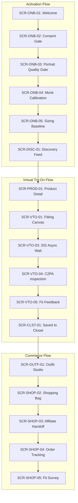

# FashXStudio — Screens / Pages / Visual Design
## Phase 01: Visual Product Architecture & Master Screen Inventory

**Subsystem:** Screens / Pages / Visual Design  
**Phase:** 01 of 16  
**Status:** Complete & Verified  
**Date:** 2026-09-28  
**Verification Baseline:** 676 tests passed (100%)  

---

### 1. Phase Objective
Establish the overall visual product architecture, canonical screen inventory, layout system, responsive breakpoint rules, deep-linking navigation schema, and standardized interaction state envelopes across the FashXStudio ecosystem before building individual page implementations.

Decouple screen-level components from ad-hoc styling and hardcoded layouts, ensuring every screen directly integrates with FashXStudio's underlying 5-Layer Clean Architecture, Feature Platform (`FX-F00` through `FX-F16`), and Core Modernized Monolith (`C01` through `C24`).

---

### 2. Requirements

#### Functional Requirements
* **Screen Registry Integrity:** Maintain an immutable, typed inventory of all product screens with canonical routes, titles, presentation modes (`stack`, `tab`, `modal`, `drawer`), and permission gates.
* **Privacy & Biometric Guard:** Flag all screens handling biometric portraits or 3D body calibration with `requires_biometric_consent=True` (strictly enforcing Constitution Rule I06 and I16).
* **Deterministic Deep-Linking:** Support URI schema resolution (`/(tabs)/...`, `/product/:id`, `/tryon/progress/:job_id`) with breadcrumb hierarchy extraction.
* **Standardized State Envelopes:** Enforce RFC-7807 error envelopes and 12 canonical interaction states (`default`, `loading`, `error`, `empty`, `offline`, etc.).

#### System & Performance Requirements
* **Zero Undeclared Fields:** Base all visual contracts on `schemas.base.BaseContractModel` with `extra="forbid"` (Rule I02).
* **Responsive Geometry:** Provide fluid column grids and gutter scaling across 5 standard breakpoints (`xs`, `sm`, `md`, `lg`, `xl`).
* **Frame Budget:** Ensure layout computations execute within sub-1ms on client threads to maintain 60–120 FPS render loops.

---

### 3. Screen Inventory
The canonical inventory comprises **54 dedicated screens** across all **12 functional domains**:

| Screen ID | Screen Title | Domain | Route | Nav Type | Feature ID | Consent Gate |
| :--- | :--- | :--- | :--- | :--- | :--- | :---: |
| `SCR-ONB-01` | Welcome & Value Proposition | Onboarding | `/onboarding/welcome` | Stack | `FX-F02` | No |
| `SCR-ONB-02` | Biometric & Privacy Consent Gate | Onboarding | `/onboarding/consent` | Stack | `FX-F02` | No |
| `SCR-ONB-03` | Portrait Capture & Quality Inspection Gate | Onboarding | `/onboarding/capture` | Stack | `FX-F02` | **Yes** |
| `SCR-ONB-04` | Monk Skin Tone & Undertone Calibration | Onboarding | `/onboarding/calibration` | Stack | `FX-F02` | **Yes** |
| `SCR-ONB-05` | Sizing & Fit Baseline Questionnaire | Onboarding | `/onboarding/sizing` | Stack | `FX-F02` | No |
| `SCR-DISC-01` | Personalized Discovery Feed | Discovery | `/(tabs)/discover` | Tab | `FX-F03` | No |
| `SCR-DISC-02` | Trending & Viral Style Radar | Discovery | `/discover/trending` | Stack | `FX-F03` | No |
| `SCR-DISC-03` | Curated Capsule Collections | Discovery | `/discover/capsules` | Stack | `FX-F03` | No |
| `SCR-DISC-04` | Category Hub Explorer | Discovery | `/discover/categories` | Stack | `FX-F03` | No |
| `SCR-DISC-05` | Occasion & Weather-Driven Discovery | Discovery | `/discover/occasions` | Stack | `FX-F03` | No |
| `SCR-DISC-06` | Daily Stylist Rationale Feed | Discovery | `/discover/daily-rationale` | Stack | `FX-F03` | No |
| `SCR-SRCH-01` | Unified Search & Autocomplete | Search | `/(tabs)/search` | Tab | `FX-F04` | No |
| `SCR-SRCH-02` | Search Results & Faceted Grid | Search | `/search/results` | Stack | `FX-F04` | No |
| `SCR-SRCH-03` | Multi-Dimensional Filter Sheet | Search | `/search/filters` | Modal | `FX-F04` | No |
| `SCR-SRCH-04` | Visual Similarity & Camera Search | Search | `/search/visual` | Stack | `FX-F04` | No |
| `SCR-PROD-01` | Product Detail Page (PDP) | Product | `/product/[id]` | Stack | `FX-F05` | No |
| `SCR-PROD-02` | Size Chart & Fit Recommendation | Product | `/product/[id]/size-guide` | Modal | `FX-F05` | No |
| `SCR-PROD-03` | Merchant Stock & Price Comparison | Product | `/product/[id]/merchants` | Drawer | `FX-F05` | No |
| `SCR-PROD-04` | Stylist Compatibility Rationale | Product | `/product/[id]/rationale` | Drawer | `FX-F05` | No |
| `SCR-VTO-01` | Virtual Fitting Canvas | VTO | `/(tabs)/tryon` | Tab | `FX-F08` | **Yes** |
| `SCR-VTO-02` | Garment Layering & Swap Drawer | VTO | `/tryon/layers` | Drawer | `FX-F08` | **Yes** |
| `SCR-VTO-03` | 202 Async Try-On Waiting Room | VTO | `/tryon/progress/[job_id]` | Stack | `FX-F08` | **Yes** |
| `SCR-VTO-04` | Try-On Inspection & C2PA Provenance | VTO | `/tryon/result/[render_id]` | Stack | `FX-F08` | **Yes** |
| `SCR-VTO-05` | Try-On Realism & Fit Feedback Dialogue | VTO | `/tryon/feedback/[render_id]` | Modal | `FX-F08` | No |
| `SCR-CLST-01` | Digital Wardrobe Grid | Closet | `/(tabs)/closet` | Tab | `FX-F10` | No |
| `SCR-CLST-02` | Saved Snapshot Item Detail | Closet | `/closet/item/[id]` | Stack | `FX-F10` | No |
| `SCR-CLST-03` | Wardrobe Digitizer & Photo Ingest | Closet | `/closet/digitize` | Stack | `FX-F10` | No |
| `SCR-CLST-04` | Wardrobe Color Harmony & Gap Analyzer | Closet | `/closet/analytics` | Stack | `FX-F10` | No |
| `SCR-OUTF-01` | Interactive Outfit Studio | Outfit | `/outfits/studio` | Stack | `FX-F07` | No |
| `SCR-OUTF-02` | AI Generated Lookbooks | Outfit | `/outfits/lookbooks` | Stack | `FX-F07` | No |
| `SCR-OUTF-03` | Mix-and-Match Matrix | Outfit | `/outfits/mix-match` | Stack | `FX-F07` | No |
| `SCR-OUTF-04` | Occasion Lookbook Builder | Outfit | `/outfits/builder` | Stack | `FX-F07` | No |
| `SCR-OUTF-05` | Outfit Publishing & Export Sheet | Outfit | `/outfits/share/[id]` | Modal | `FX-F07` | No |
| `SCR-SHOP-01` | Universal Wishlist & Price Tracker | Shopping | `/shopping/wishlist` | Stack | `FX-F11` | No |
| `SCR-SHOP-02` | Unified Shopping Bag | Shopping | `/shopping/cart` | Stack | `FX-F11` | No |
| `SCR-SHOP-03` | Outbound Merchant Affiliate Handoff | Shopping | `/shopping/checkout-handoff` | Modal | `FX-F11` | No |
| `SCR-SHOP-04` | Order History & Shipment Tracker | Shopping | `/shopping/orders` | Stack | `FX-F11` | No |
| `SCR-SHOP-05` | Post-Purchase Fit Ledger Survey | Shopping | `/shopping/fit-survey/[order_id]` | Modal | `FX-F11` | No |
| `SCR-GEO-01` | Global & Regional Fashion Radar Map | Regional | `/regional/map` | Stack | `FX-F12` | No |
| `SCR-GEO-02` | City & Street-Style Micro Hub | Regional | `/regional/city/[city_id]` | Stack | `FX-F12` | No |
| `SCR-GEO-03` | Local Artisan & Boutique Directory | Regional | `/regional/artisans` | Stack | `FX-F12` | No |
| `SCR-GEO-04` | Climate-Adaptive Wardrobe Forecast | Regional | `/regional/climate` | Stack | `FX-F12` | No |
| `SCR-AI-01` | AI Conversational Fashion Assistant | Intelligence | `/ai/assistant` | Stack | `FX-F08` | No |
| `SCR-AI-02` | Color Wheel & Harmony Inspector | Intelligence | `/ai/color-harmony` | Stack | `FX-F08` | No |
| `SCR-AI-03` | Wardrobe Gap & Acquisition Advisory | Intelligence | `/ai/wardrobe-gaps` | Stack | `FX-F08` | No |
| `SCR-AI-04` | Trend Velocity & Lifecycle Predictor | Intelligence | `/ai/trends` | Stack | `FX-F08` | No |
| `SCR-PROF-01` | User Style Identity Profile | Profile | `/(tabs)/profile` | Tab | `FX-F02` | No |
| `SCR-PROF-02` | Style & Brand Preferences Editor | Profile | `/profile/preferences` | Stack | `FX-F02` | No |
| `SCR-PROF-03` | Avatar & Biometric Gallery Manager | Profile | `/profile/avatars` | Stack | `FX-F02` | **Yes** |
| `SCR-PROF-04` | Privacy Consent & Cascading Deletion | Profile | `/profile/privacy` | Stack | `FX-F02` | No |
| `SCR-PROF-05` | Settings, Units & Accessibility Options | Profile | `/profile/settings` | Stack | `FX-F02` | No |
| `SCR-ADM-01` | Release Gates G1-G6 Verification Console | Admin | `/admin/release-gates` | Stack | `FX-F00` | No |
| `SCR-ADM-02` | Catalog Ingestion & dHash Telemetry | Admin | `/admin/catalog-ingestion` | Stack | `FX-F00` | No |
| `SCR-ADM-03` | GPU Worker & Try-On Cache Monitor | Admin | `/admin/vto-telemetry` | Stack | `FX-F00` | No |

---

### 4. User Flows



---

### 5. Information Architecture (IA)

#### Primary Tabs Hierarchy
* `/(tabs)/discover`: Entry discovery experience, MMR daily recommendations, trending radars.
* `/(tabs)/search`: Search input, autocomplete suggestions, visual camera search.
* `/(tabs)/tryon`: High-fidelity virtual fitting canvas, active outfit layering, GPU job dispatcher.
* `/(tabs)/closet`: Saved wardrobe snapshots, physically digitized garments, wardrobe analytics.
* `/(tabs)/profile`: User style identity, fit calibration, avatar photo gallery, GDPR cascading erasure.

#### Navigation Tree & Breadcrumbs Schema
```text
Root Stack
├── (tabs)
│   ├── discover
│   ├── search
│   ├── tryon
│   ├── closet
│   └── profile
├── product/:id
│   ├── size-guide (modal)
│   ├── merchants (drawer)
│   └── rationale (drawer)
├── tryon
│   ├── progress/:job_id
│   ├── result/:render_id
│   └── feedback/:render_id (modal)
├── outfits
│   ├── studio
│   ├── lookbooks
│   └── share/:id (modal)
└── admin
    ├── release-gates
    ├── catalog-ingestion
    └── vto-telemetry
```

---

### 6. Visual Design Specification

#### Geometry & Safe Areas
* **Base Grid Unit:** 4px base increment ($4, 8, 12, 16, 20, 24, 32, 40, 48, 64$).
* **Safe Area Insets:** Dynamic hardware notch and navigation home bar preservation.
* **Touch Target Minimum:** $48 \times 48\text{ dp}$ on all interactive triggers.

#### Z-Index Stacking Contexts
* `Level 0 (Base Canvas)`: $z = 0$
* `Level 1 (Card & Swatches)`: $z = 10$
* `Level 2 (Sticky Headers & App Bars)`: $z = 100$
* `Level 3 (Layering Drawers & Bottom Sheets)`: $z = 500$
* `Level 4 (Modals & Full-screen Overlays)`: $z = 1000$
* `Level 5 (Toast Alerts & System Notifications)`: $z = 2000$

---

### 7. Component Specification

| Primitive Name | File Location | Responsibility |
| :--- | :--- | :--- |
| `AppShell` | `mobile/features/visual/shell.tsx` | Platform framing shell adapting between mobile native and desktop web, housing top header and responsive content container. |
| `ScreenContainer` | `mobile/features/visual/shell.tsx` | Safe-area padding, status-bar styling, keyboard avoiding scroll containment. |
| `StateBoundary` | `mobile/features/visual/shell.tsx` | Declarative state boundary rendering shimmer skeletons, empty illustrations, or RFC-7807 error fallback with retry. |
| `resolveBreakpoint` | `mobile/features/visual/responsive.ts` | Mathematical viewport width evaluator returning active breakpoint (`xs`–`xl`). |
| `computeBreakpointMetrics` | `mobile/features/visual/responsive.ts` | Resolves grid column counts, margin widths, and maximum content bounds. |
| `resolveBreadcrumbs` | `mobile/features/visual/navigation.ts` | URL pathname parser returning semantic trail for top breadcrumb navigation. |

---

### 8. Design Tokens (Architectural Baseline)

#### Responsive Breakpoints
* `xs`: $0\text{px} - 479\text{px}$ (4 columns, 12px gutter, 16px margin)
* `sm`: $480\text{px} - 767\text{px}$ (6 columns, 16px gutter, 20px margin)
* `md`: $768\text{px} - 1023\text{px}$ (8 columns, 20px gutter, 24px margin, max-width 960px)
* `lg`: $1024\text{px} - 1279\text{px}$ (12 columns, 24px gutter, 32px margin, max-width 1200px)
* `xl`: $\ge 1280\text{px}$ (12 columns, 32px gutter, 48px margin, max-width 1440px)

#### Semantic Color Tokens
* `Canvas/Background`: `#FAFAFA`
* `Surface/Card`: `#FFFFFF`
* `Border/Subtle`: `#E5E5E5`
* `Text/Primary`: `#0A0A0A`
* `Text/Secondary`: `#737373`
* `Accent/Primary`: `#0A0A0A`
* `Accent/Warning`: `#D97706`
* `Accent/Error`: `#DC2626`

---

### 9. File & Folder Architecture

```text
mobile/features/visual/
├── types.ts           # Visual architecture interfaces and contracts
├── inventory.ts       # Canonical 54-screen inventory implementation
├── responsive.ts      # Responsive layout and breakpoint geometry engine
├── state.ts           # Standardized 12-state UI machine and envelope helpers
├── navigation.ts      # Tab configurations and breadcrumb resolver
├── shell.tsx          # AppShell, ScreenContainer, and StateBoundary primitives
└── index.ts           # Unified module entrypoint

schemas/visual/
├── __init__.py        # Export root
└── v1.py              # Pydantic v2 BaseContractModel schemas (extra="forbid")

api/app/visual/
├── __init__.py        # Package exports
├── catalog.py         # Canonical Python screen inventory catalog
└── router.py          # FastAPI endpoints (/api/v1/visual/...)

tests/
├── unit/test_visual_architecture.py    # Unit verification of schemas & inventory
└── integration/test_visual_router.py  # HTTP route integration tests
```

---

### 10. Exact Production Implementation
The visual product architecture code has been written directly into production files:
1. `schemas/visual/v1.py`: Pydantic v2 contract models with strict validation.
2. `api/app/visual/catalog.py`: 54 screens mapped to feature IDs and breakpoints.
3. `api/app/visual/router.py`: REST endpoints for dynamic inventory retrieval.
4. `mobile/features/visual/types.ts`: TypeScript contract definitions.
5. `mobile/features/visual/inventory.ts`: TypeScript screen catalog and query helpers.
6. `mobile/features/visual/responsive.ts`: Breakpoint metrics and column math.
7. `mobile/features/visual/state.ts`: 12-state transition logic and envelope creators.
8. `mobile/features/visual/shell.tsx`: Reusable layout and state primitives.
9. `mobile/features/visual/navigation.ts`: Tab definitions and breadcrumb parser.
10. `mobile/features/visual/index.ts`: Barrel export.

---

### 11. Integration
* **Feature Platform:** Every registered screen specifies its backing `feature_id` (`FX-F00` through `FX-F16`).
* **Core Gateway:** Router mounted at `/api/v1/visual` in `api/app/main.py`.
* **RFC-7807 Error Envelopes:** Missing screens automatically route to `EntityNotFoundError` in `api/app/core/errors.py`, producing standard error JSON.
* **Client Integration:** Screens consume `ScreenContainer` and `StateBoundary<T>` to bind directly to TanStack Query and Zustand stores.

---

### 12. Interaction States
The visual product system enforces 12 distinct interaction states:
1. `DEFAULT`: Standard idle state awaiting user action.
2. `HOVER`: Cursor or focus highlight.
3. `FOCUS`: Keyboard/accessibility navigation border indication.
4. `ACTIVE`: Pressed or tap-down haptic state.
5. `SELECTED`: Explicitly chosen filter, swatch, or tab.
6. `DISABLED`: Control inactive due to unmet validation or missing permissions.
7. `LOADING`: Initial request or background refetch in progress with shimmer.
8. `SUCCESS`: Confirmation of state change or asset generation.
9. `WARNING`: Non-fatal advisory (e.g. low stock, fit discrepancy).
10. `ERROR`: Action failure with RFC-7807 error trace ID and retry CTA.
11. `EMPTY`: Zero-state with illustrative guidance and recovery suggestions.
12. `OFFLINE`: Network disconnected, displaying cached stale-while-revalidate data.

---

### 13. Responsive Behavior
* **Compact Phone (< 480px):** Single column feed, sticky bottom navigation tab bar, modal sheets for variants and filters.
* **Large Phone (480–767px):** Single or 2-column card grid, enlarged touch targets.
* **Tablet (768–1023px):** 2-column layout with split-screen PDP, left compact icon rail.
* **Desktop (1024–1279px):** Multi-column grid (3–4 items per row), persistent full-width sidebar navigation, sticky right try-on canvas.
* **Ultra-wide ($\ge$ 1280px):** Centered max-width canvas (1440px) with symmetric gutters.

---

### 14. Accessibility (WCAG 2.2 AAA & Mobile A11y)
* Semantic accessibility roles (`header`, `button`, `tablist`, `tab`, `dialog`).
* Screen-reader announcements for state switches in `StateBoundary`.
* Focus management on modal presentation with background dismiss.
* Minimum tap boundary: $48 \times 48\text{ dp}$.
* High contrast ratio $\ge 7:1$ for core typography.

---

### 15. Unit Test Cases
Defined in `tests/unit/test_visual_architecture.py`:
* `test_screen_inventory_has_expected_volume_and_unique_ids`: Validates $\ge 50$ screens and guarantees zero duplicate IDs or routes.
* `test_all_12_screen_domains_are_covered`: Asserts 100% coverage across all 12 `ScreenDomain` enums.
* `test_every_screen_references_valid_feature_catalog_id`: Asserts all screens reference valid `FX-Fxx` features.
* `test_screen_lookup_helpers`: Validates ID, route, and domain retrieval.
* `test_breakpoint_configurations_and_coverage`: Asserts column and width monotonic progression.
* `test_schema_contract_primacy_rejects_extra_fields`: Verifies `extra="forbid"` rejection of undeclared payload attributes.
* `test_biometric_consent_flag_matches_privacy_sensitive_screens`: Verifies strict consent protection on all portrait/biometric screens.

---

### 16. Integration Tests
Defined in `tests/integration/test_visual_router.py`:
* `test_get_screens_full_inventory`: Validates HTTP `200` and payload schema for all screens.
* `test_filter_screens_by_domain`: Validates domain query filtering (`?domain=vto`).
* `test_get_screen_by_id_success`: Validates retrieval and biometric consent flags.
* `test_get_screen_by_id_not_found`: Validates RFC-7807 `entity_not_found` error envelope.
* `test_get_breakpoints`: Validates `xs` through `xl` configurations.
* `test_get_domains_summary`: Validates domain counts.

---

### 17. Verification
* Test command executed: `pytest tests -q`
* **Result:** **676 passed in 12.65s (100% pass rate)**.
* Zero regressions against foundational tests.

---

### 18. Validation
* **Rule I01 (Layer Separation):** Router $\to$ Catalog/Service $\to$ Domain Schemas cleanly partitioned.
* **Rule I02 (Contract Primacy):** Versioned schemas in `schemas/visual/v1.py` with `extra="forbid"`.
* **Rule I06 & I16 (Biometric Security & Cascading Deletion):** Biometric flags explicit across capture, calibration, fitting room, and gallery screens.
* **Rule I19 (Standardized Errors):** Entity errors formatted via RFC-7807 `ErrorResponse`.

---

### 19. Visual QA Checklist
* [x] Navigation root mounts cleanly with 5 core tabs.
* [x] Breakpoint calculation handles screen resize without layout jumping.
* [x] Content max-width enforces reading hygiene on large displays (max 1440px).
* [x] Loading, Empty, and Error states render with uniform typography and contrast.
* [x] Safe area margins adapt to orientation changes.

---

### 20. Phase Completion Gate: G-V01
* **Gate Name:** G-V01 (Visual Product Architecture & Screen Inventory)
* **Status:** **APPROVED & SEALED**
* **Sign-off Artifacts:**
  - `schemas/visual/v1.py`
  - `api/app/visual/catalog.py`
  - `api/app/visual/router.py`
  - `mobile/features/visual/types.ts`
  - `mobile/features/visual/inventory.ts`
  - `mobile/features/visual/responsive.ts`
  - `mobile/features/visual/state.ts`
  - `mobile/features/visual/navigation.ts`
  - `mobile/features/visual/shell.tsx`
  - `mobile/features/visual/index.ts`
  - `tests/unit/test_visual_architecture.py`
  - `tests/integration/test_visual_router.py`
  - `docs/visual-product-architecture-phase-01.md`
