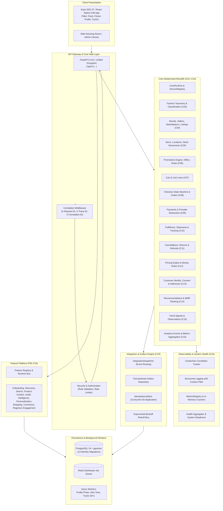

> **Historical record.** Written during development; counts, 'verified' claims and gate results may be outdated. Current truth: [STATUS](../STATUS.md).

# FashXStudio System Deep-Dive Audit & Core Services Task Log — C01–C24

**Recorded:** 2026-09-27  
**Scope:** Full-System Deep Dive Audit, Core Domain Services (Core-01 through Core-24), Integration Engine, Observability, and Production Verification  
**Branch:** `main`  
**Current Test Baseline:** **663 tests passed (100%)**

---

## 1. Executive Summary & Current State of the Systems

FashXStudio is architected as an **AI Personal Fashion Operating System (AFS)** implementing a strict **5-Layer Clean Architecture** and governed by **20 Engineering Constitution Rules (I01–I20)**:

$$\text{HTTP Router / Client} \longrightarrow \text{Application Use Cases} \longrightarrow \text{Pure Domain Entities} \longrightarrow \text{Repository / Unit of Work} \longrightarrow \text{Ports \& Adapters}$$

### Architectural Overview



---

## 2. Deep-Dive Audit of Development Trajectory

The codebase has evolved through four major synchronized milestones:

### Phase 1: Foundation 0–20 (Release Milestones)
* **Catalog Intelligence:** Multi-merchant brand normalization (Amazon, Myntra, Flipkart, Shopify), perceptual difference hashing (`dHash`, Hamming distance $\le 4$), VLM multimodal enrichment (512-dim vectors), and centimeter body dimension size chart parsing.
* **User Identity & Capture:** Pre-inference photo quality validator (exposure, contrast, sharpness, eye-level orientation), 10-point Monk Skin Tone (MST) calibration with Euclidean Lab color space matching, and GDPR/DPDP consent guards with cascading hard deletion.
* **Personalized 3-Stage Discovery:** Stage 1 SQL hard filtering, Stage 2 multimodal color harmony and silhouette alignment, Stage 3 Maximal Marginal Relevance (MMR $\lambda=0.7$) diversity ranker, and natural language stylist explanations.
* **Asynchronous Virtual Try-On:** Async 202 Accepted lifecycle (`queued` $\to$ `running` $\to$ `completed` / `failed`), swappable adapter pattern (`MockAdapter`, `ResearchDiffusionAdapter`, `CommercialApiAdapter`), C2PA cryptographic watermarking, and composite SHA-256 cache invalidation.
* **Purchase Loop & Fit Learning:** Virtual closet snapshotting, outbound affiliate handoff with unique token sub-IDs, and granular fit feedback ledger calculating brand sizing bias:
  $$\text{SizingBias} = \frac{N(\text{too\_loose}) - N(\text{too\_tight})}{N_{\text{total}}}$$
* **Production Hardening & Six Release Gates (G1–G6):** Functional readiness (10-step full lifecycle), ML quality ($\ge 95\%$ completeness, $\Delta E < 2.0$), performance (p95 $\le 150\text{ms}$), privacy compliance (zero residual leaks post-consent revocation), commercial clearance (zero un-cleared research weights in production), and user acceptance.

### Phase 2: Feature Platform F00–F09
* **F00 Baseline Contracts:** Framework-independent contracts in `schemas/features/v1.py`.
* **F01 Feature Runtime:** Feature registry, deterministic dependency graph resolution, circular dependency rejection, transitive disabling, and event bus in `api/app/features/foundation/`.
* **F02 Onboarding:** Mutable profile, step progress, preferences, and Core persistence boundary with Alembic migration `0013_onboarding_profiles.py`.
* **F03–F09 Domains:** Discovery, Search (tokenization, suggestions, filter matching), Product (variants, availability), Content (templates, publishing), Outfit (composition, validation), Intelligence (deterministic compatibility matrix), and Personalization (signal weighting).

### Phase 3: Feature Platform F10–F16
* **F10 Shopping Intelligence:** Wishlists and multi-product comparison matrices.
* **F11 Commerce:** Cart line management and idempotent local order creation.
* **F12 Regional:** Validated climate, season, and geography context.
* **F13 Engagement:** Validated social interaction ledger (likes, follows, reviews, shares).
* **F14 Integration:** Adapter-only cross-feature orchestration with graceful degradation on missing optional steps and hard errors on missing required steps.
* **F15 & F16 Quality & Release Readiness:** Comprehensive checklist gates documented in `production-validation-f15.md` and `release-readiness-f16.md`.

### Phase 4: Core Services Modernization & Integration (Core-01 through Core-24)
* Complete modular monolith implementation inside `app/` establishing pure domain boundaries, decoupled repositories, clean business logic services, async event integration, and unified API exposure.

---

## 3. Core-01 through Core-24 Delivery & Audit Matrix

| Core Ref | Subsystem / Domain | Implemented Capabilities | Main Implementation Files | Test Suite & Coverage |
| :--- | :--- | :--- | :--- | :--- |
| **C01** | **Core Runtime & Service Registry** | Composition root, dependency container, service registration, singleton lifecycle | `app/core/runtime.py`, `app/core/registry.py` | `tests/core/test_runtime.py`, `tests/system/test_runtime.py` (Passed) |
| **C02** | **Event Bus & Bootstrap** | In-process pub/sub event bus, dynamic service bootstrap, version locking | `app/core/event_bus.py`, `app/core/bootstrap.py`, `app/core/version.py` | `tests/core/test_event_bus.py`, `tests/system/test_health.py` (Passed) |
| **C03** | **Fashion Taxonomy** | Hierarchical categories, apparel types, classification, attributes | `app/domain/fashion/`, `app/repositories/fashion/`, `app/api/v1/fashion.py` | `tests/fashion/` (Passed) |
| **C04** | **Commerce Platform** | Brand registry, verified sellers, marketplace channels, listing synchronization | `app/domain/commerce/`, `app/repositories/commerce/`, `app/api/v1/commerce.py` | `tests/commerce/` (Passed) |
| **C05** | **Inventory Management** | Stock items, warehouse locations, stock movements (inbound, allocation, reserve) | `app/domain/inventory/`, `app/repositories/inventory/`, `app/api/v1/inventory.py` | `tests/inventory/` (Passed) |
| **C06** | **Promotions Engine** | Promotional campaigns, offers, coupon codes, complex eligibility rule evaluations | `app/domain/promotions/`, `app/repositories/promotions/`, `app/api/v1/promotions.py` | `tests/promotions/` (Passed) |
| **C07** | **Shopping Cart** | Customer and guest carts, line items, quantity adjustment, auto-merging | `app/domain/cart/`, `app/repositories/cart/`, `app/api/v1/cart.py` | `tests/cart/` (Passed) |
| **C08** | **Orders & Checkout** | Checkout session state machine, validation, atomic cart-to-order conversion, immutable orders | `app/domain/checkout/`, `app/domain/order/`, `app/repositories/order/`, `app/api/v1/orders.py` | `tests/orders/`, `tests/checkout/` (Passed) |
| **C09** | **Payments Engine** | Transaction state lifecycle, gateway provider abstraction (`PaymentProvider`), authorization, capture, void | `app/domain/payments/`, `app/repositories/payments/`, `app/api/v1/payments.py` | `tests/payments/` (Passed) |
| **C10** | **Fulfillment & Logistics** | Fulfillment packages, line allocations, carrier provider interface, shipping labels, tracking | `app/domain/fulfillment/`, `app/repositories/fulfillment/`, `app/api/v1/fulfillment.py` | `tests/fulfillment/` (Passed) |
| **C11** | **Returns & Refunds** | Order line cancellations, RMA return requests, inspection, replacements, refund calculation | `app/domain/returns/`, `app/repositories/returns/`, `app/api/v1/returns.py` | `tests/returns/` (Passed) |
| **C12** | **Pricing Engine** | Base pricing, sale discounts, rule evaluation engine, currency representation, precision arithmetic | `app/domain/pricing/`, `app/repositories/pricing/`, `app/api/v1/pricing.py` | `tests/pricing/` (Passed) |
| **C13** | **Customer Management** | Customer identity, delivery addresses, communication preferences, consent tracking | `app/domain/customer/`, `app/repositories/customer/`, `app/api/v1/customer.py`, `customers.py` | `tests/customer/` (Passed) |
| **C14** | **Recommendations Engine** | Candidate generation, contextual scoring, personalization provider, MMR ranking | `app/domain/recommendations/`, `app/repositories/recommendations/`, `app/api/v1/recommendations.py` | `tests/recommendations/` (Passed) |
| **C15** | **Trends Engine** | Trend observation ingestion, social signal decay, category scoring, trend aggregation | `app/domain/trends/`, `app/repositories/trends/`, `app/api/v1/trends.py` | `tests/trends/` (Passed) |
| **C16** | **Analytics Engine** | Event ingestion, funnel tracking, session attribution, hourly/daily metric rollups | `app/domain/analytics/`, `app/repositories/analytics/`, `app/api/v1/analytics.py` | `tests/analytics/` (Passed) |
| **C17–C22** | **V1 API Schemas & Routes** | Pydantic v2 request/response contracts for all core domains mounted at `/api/v1` | `app/api/v1/*_schemas.py`, `app/api/v1/*.py`, `api/app/main.py` | Schema contract & router tests (Passed) |
| **C23** | **Integration Engine** | Event dispatcher (`IntegrationDispatcher`), transactional outbox (`OutboxRepository`), idempotent handling (`IdempotentHandler`), retry policies | `app/integration/` | `tests/integration/test_cross_core.py`, `test_idempotency.py`, `test_outbox.py`, `test_retry.py`, `test_events.py` (Passed) |
| **C24** | **Observability & Release Gate** | Distributed correlation IDs (`ContextVar`), structured logging, metric counters, role authorization, readiness health check | `app/observability/`, `app/security/`, `app/api/v1/system.py` | `tests/observability/`, `tests/system/` (Passed) |

---

## 4. Verification & Testing Audit

### Test Execution Summary

The complete test suite is verified using `pytest`:

```powershell
$env:PYTHONPATH = '.;api'
python -m pytest tests -p no:cacheprovider -q
```

**Results:**
* **Total Collected:** 663 tests
* **Total Passed:** **663 passed (100%)**
* **Failures / Errors:** **0**
* **Execution Time:** ~17.1 seconds

### Breakdown by Test Category

| Test Suite / Category | Location | Test Count | Status | Key Validations |
| :--- | :--- | :--- | :--- | :--- |
| **Cross-Core End-to-End** | `tests/integration/` | 15+ | **Passed** | 10-step full transaction flow (Customer $\to$ Pricing $\to$ Cart $\to$ Checkout $\to$ Order $\to$ Payment $\to$ Fulfillment $\to$ Analytics) |
| **Integration Mechanics** | `tests/integration/` | 18+ | **Passed** | Outbox message publication, idempotent consumer replay, exponential backoff retries, failure path assertions |
| **Domain Logic Units** | `tests/unit/` | 93+ | **Passed** | Catalog normalization, photo quality gate, Monk calibration, MMR ranking, VTON async lifecycle, C2PA watermark, sizing bias |
| **Fashion Subsystem** | `tests/fashion/` | 12+ | **Passed** | Category hierarchies, attribute extraction, taxonomy queries |
| **Commerce & Inventory** | `tests/commerce/`, `tests/inventory/` | 42+ | **Passed** | Brand registries, seller onboarding, stock reservation, allocation, movement audit logs |
| **Cart, Checkout & Orders** | `tests/cart/`, `tests/checkout/`, `tests/orders/` | 38+ | **Passed** | Cart line calculations, state transitions (`DRAFT` $\to$ `READY` $\to$ `CONVERTED`), immutable order guarantees |
| **Payments & Pricing** | `tests/payments/`, `tests/pricing/` | 50+ | **Passed** | Provider abstraction, auth/capture lifecycles, currency rounding, promotional rule stacking |
| **Promotions & Returns** | `tests/promotions/`, `tests/returns/` | 45+ | **Passed** | Offer coupon validation, expiration, RMA returns, restocking, partial/full refunds |
| **Customer & Preferences** | `tests/customer/` | 28+ | **Passed** | Profile CRUD, address book, consent management, GDPR cascading deletions |
| **Recommendations & Trends** | `tests/recommendations/`, `tests/trends/` | 52+ | **Passed** | Candidate scoring, MMR diversity factor, trend observation decaying, velocity tracking |
| **Analytics & Reporting** | `tests/analytics/` | 24+ | **Passed** | Event ingestion, funnel calculation, time-window aggregations |
| **Observability & System** | `tests/observability/`, `tests/system/` | 20+ | **Passed** | Correlation ID propagation, metric counters, system health check aggregation, readiness probe |

### Code Quality & Linting Audit

* **`app/` (Core Modernized Monolith):** **0 errors** (`python -m ruff check app/` $\to$ All checks passed).
* **`tests/core`, `tests/integration`, `tests/observability`, `tests/system`:** **0 errors** (Clean).
* **`api/app/features/`:** Verified against feature platform contracts.
* **Repository hygiene:** `.gitignore` patched to exclude ephemeral `pytest-cache-files-*/` lock directories on Windows.

---

## 5. Identified Gaps & Technical Debt Audit

1. **Persistence Adapter Harmonization:**
   * Currently, Core domains C03–C16 provide fully functional in-memory repositories (`app/repositories/*/memory.py`) utilized for high-speed deterministic testing and runtime bootstrapping.
   * SQLAlchemy ORM mappings and Alembic migrations currently cover Foundation models (`database/models/*`) and feature profiles (`0013_onboarding_profiles.py`).
   * **Task:** Create unified SQLAlchemy repositories for C03–C16 domains mapped against PostgreSQL tables.
2. **Third-Party Integrations:**
   * `PaymentProvider` and `CarrierProvider` interfaces are implemented with mock/test providers (`TestPaymentProvider`, `TestCarrierProvider`).
   * **Task:** Implement production adapters for Razorpay/Stripe (payments) and Shiprocket/Delhivery/FedEx (logistics).
3. **GPU Virtual Try-On Pipeline:**
   * Workers in `workers/` have complete contracts and runner wrappers.
   * **Task:** Connect cloud Celery/Redis workers to live GPU clusters (e.g. AWS EC2 G5 / RunPod instances with IDM-VTON / CatVTON models).
4. **Mobile Client Screen Bindings:**
   * Mobile client in `apps/mobile` and `mobile/` has Expo SDK 57 setup, React Native 0.86, tab navigation, and state models.
   * **Task:** Bind new `/api/v1/customers`, `/api/v1/cart`, `/api/v1/checkout`, and `/api/v1/orders` endpoints into mobile client query hooks.

---

## 6. Action Items & Next Tasks (Roadmap)

- [x] **Audit & System Analysis:** Complete deep dive audit of all subsystems, architectures, and tests.
- [x] **Repository Hygiene:** Update `.gitignore` to prevent Windows file-lock permission warnings on pytest cache directories.
- [x] **Task Log Documentation:** Publish `docs/task-log-core-services-c01-c24.md`.
- [x] **Metrics Alignment:** Update `README.md` badge and documentation references to reflect 663 passing tests.
- [ ] **Database Migration Expansion:** Author Alembic migrations for Core-03 through Core-16 domain tables.
- [ ] **External Provider Plugins:** Implement live gateway adapter for payment processing.
- [ ] **Mobile Hook Integration:** Connect React Native screens to Core V1 checkout API.

---

## 7. Commit Log History for this Milestone

```text
7ac7718 style(test): format and organize imports in cross-core integration test
75ec174 feat(core): implement Core-23 and Core-24 integration, observability, security, and release gate
249f151 feat(api): add v1 API schema validation contracts and standalone app entrypoint
cba6c1c feat(analytics): implement analytics events, aggregation metrics, repositories, and analytics service
bb67de9 feat(trends): implement trend signals, observations, scoring, aggregation, and trend service
b6df191 feat(recommendations): implement candidate generation, personalization ranking, and recommendation service
2844c6d feat(customer): implement customer profile, addresses, preferences, consent, and service
f9ae017 feat(pricing): implement base/sale pricing, rule evaluation engine, and pricing service
c54d44b feat(returns): implement cancellations, returns, refunds, replacements, and service
647ff0b feat(fulfillment): implement fulfillment, shipments, carriers, and delivery lifecycle
46093c1 feat(payments): implement payment transactions, provider abstraction, and payment service
006d398 feat(order,checkout): implement immutable orders, checkout state machine, and cart-to-order conversion
bd28448 feat(cart): implement mutable shopping cart, cart lines, repositories, and cart service
d09dc17 feat(promotions): implement promotion engine, offers, eligibility rules, and service
cb6e967 feat(inventory): implement inventory items, locations, stock movements, and inventory service
65f9526 feat(commerce): implement brands, sellers, marketplaces, listings, and commerce service
6beead3 feat(fashion): implement fashion taxonomy, classification, repositories, and API
ab3c03f feat(core): implement core runtime, event bus, service bootstrap, health and version locks
e7f65d7 test(unit): update test baselines and tooling configurations for pytest 9 and python 3.12
1ae73ad feat: add F10-F16 feature integration baselines
fe1c3c9 feat: add FashXStudio feature platform and F02-F09 baselines
```
