# Production Build Walkthrough: Complete System Verification (Foundations 0–2 & Phases 1–6)

The entire production baseline for **FashXStudio** (AI Personal Fashion Operating System) has been fully implemented, verified, hardened, and committed. The implementation spans all architectural layers and subsystems according to the **20 Engineering Constitution Rules (I01–I20)**, the **Master Development Roadmap v1.1**, and the **Six Explicit Release Gates (G1–G6)**.

---

## Complete Subsystem Architecture & Status

```mermaid
flowchart TD
    subgraph Foundation ["Foundations 0–2 (Core Infrastructure)"]
        F0["Foundation 0: Shell + Config + Migrations + Sentry"]
        F1["Foundation 1: Versioned Pydantic v2 Contracts + DDL"]
        F2["Foundation 2: Unit of Work + BaseRepository + Idempotency"]
    end

    subgraph Phase1 ["Phase 1: Catalog Intelligence Subsystem"]
        Norm["Brand & Text Normalizer"]
        Dedup["Deduplication Engine (dHash & SHA-256)"]
        Enrich["Garment Enricher (Attributes & Embeddings)"]
        Size["Size Chart Parser (Centimeter Normalizer)"]
        Gate["Catalog Quality Gate (98% SLA)"]
    end

    subgraph Phase2 ["Phase 2: User Identity & Capture Subsystem"]
        PhotoVal["Pre-Inference Photo Quality Gate (Exposure, Contrast, Blur, Framing)"]
        SkinTone["Monk Skin Tone Calibrator (10-Centroid Palette & Undertones)"]
        Consent["GDPR / DPDP Consent Guard (Strict Body Photo Authorization)"]
        Prefs["Style Preferences & Sizing Constraints"]
    end

    subgraph Phase3 ["Phase 3: Personalized Discovery & Recommender Engine"]
        Filt["Stage 1: Deterministic Hard Filter (Stock, Budget, Exclusions)"]
        Compat["Stage 2: Multimodal Compatibility Matrix (Color Harmony, Silhouettes)"]
        MMR["Stage 3: Maximal Marginal Relevance (MMR) Ranker (λ=0.7)"]
        Stylist["Natural Language Stylist Explainer"]
        FeedUC["GenerateFeedUseCase + API Endpoints"]
    end

    subgraph Phase4 ["Phase 4: Virtual Try-On Subsystem (VTO Engine)"]
        CacheKey["Composite SHA-256 Cache Invalidation Key Engine"]
        Adapters["Swappable Model Adapters (Mock, Research Diffusion, Commercial API)"]
        Watermark["Synthetic Watermarker (C2PA Invisible & Visual Branding)"]
        PostVal["Post-Inference Quality Validator (Luminance & Artifact Sanity Check)"]
        AsyncJob["Asynchronous 202 Accepted Execution Lifecycle"]
    end

    subgraph Phase5 ["Phase 5: Purchase Loop & Fit Learning Engine"]
        Wardrobe["Virtual Closet Snapshotting Engine"]
        Handoff["Affiliate Handoff & Tracking Sub-IDs Engine"]
        FitLedger["Granular Fit Feedback Ledger & Brand Calibration"]
        VTOFeed["Try-On Realism & Confidence Collector"]
    end

    subgraph Phase6 ["Phase 6: Production Hardening, Privacy & Six-Gate Audit"]
        CascadingDel["GDPR/DPDP Cascading Hard Deletion (Rule I16)"]
        Auditor["Production Readiness Auditor (Gates G1–G6)"]
        E2E["Full-Lifecycle End-to-End Consumer Journey Test"]
    end

    Foundation --> Phase1
    Foundation --> Phase2
    Phase1 --> Phase3
    Phase2 --> Phase3
    Phase3 --> Phase4
    Phase4 --> Phase5
    Phase5 --> Phase6
```



---

## Phase 6 Implementation Details

### 1. Privacy Cascading Hard Deletion Engine (Rule I16 & Gate G4)
- [`RevokeConsentUseCase`](file:///c:/Users/ASUS/Documents/FashXStudio/ai-fashion-assistant-foundation-0/api/app/profile/application/revoke_consent.py):
  - In strict adherence to GDPR Right to be Forgotten and India DPDP 2023, revoking biometric/body photo consent executes atomic cascading hard deletion:
    1. Mark consent as revoked in `consents` table.
    2. Query all user photos in `user_photos`.
    3. Purge physical objects from storage using `StoragePort.delete(storage_key)`.
    4. Delete photo records from `user_photos` table.
    5. Delete associated try-on jobs and artifacts from `tryon_artifacts` and `tryon_jobs`.
  - Guarantees zero orphaned biometric media across both relational storage and object stores.
- **API Endpoint**: `POST /api/v1/profile/{user_id}/consent/revoke` ([router.py](file:///c:/Users/ASUS/Documents/FashXStudio/ai-fashion-assistant-foundation-0/api/app/profile/router.py)).

### 2. Six-Gate Production Readiness Auditor (Rule I17)
- [`ProductionReadinessAuditor`](file:///c:/Users/ASUS/Documents/FashXStudio/ai-fashion-assistant-foundation-0/api/app/core/readiness_audit.py):
  Formally evaluates each release gate before deployment:
  - **Gate G1 (Functional Readiness)**: Verifies that all 10 steps of the consumer journey succeed without invariant violations.
  - **Gate G2 (ML Quality)**: Asserts that VLM enrichment completeness $\ge 95\%$, Monk skin tone calibration $\Delta E < 2.0$, and VTO visual quality meets SSIM/PSNR minimums.
  - **Gate G3 (Performance & Latency)**: Asserts API p95 $\le 150$ms, Discovery feed $\le 300$ms, and VTO synthesis $\le 6$s.
  - **Gate G4 (Privacy Compliance)**: Asserts 0 residual leaked objects post-consent revocation and exact 1:1 match between database records purged and storage objects deleted.
  - **Gate G5 (Commercial Clearance)**: Asserts zero active research diffusion weights (e.g. non-commercial IDM-VTON / CatVTON) in production environments (`adapter_type != "research_diffusion"`).
  - **Gate G6 (User Acceptance)**: Asserts $\ge 75\%$ try-on realism satisfaction score and $\ge 80\%$ recommendation feed relevance score.

---

## End-to-End System Validation (`test_end_to_end_journey.py`)

A single, continuous integration test validates the complete 10-step consumer lifecycle:

```mermaid
sequenceDiagram
    autonumber
    actor User
    participant Profile as Profile Subsystem
    participant Catalog as Catalog Subsystem
    participant Reco as Reco Subsystem
    participant VTO as Try-On Subsystem
    participant Commerce as Commerce Subsystem
    participant Storage as Object Storage

    User->>Profile: Step 1: Create Profile (Height: 182cm, Weight: 78kg, Build: athletic)
    User->>Profile: Step 2: Upload Reference Photo (Quality Gate + Monk Skin Tone Calibrated)
    Profile->>Storage: Store portrait in user_photos
    User->>Profile: Step 3: Set Style Preferences (Favored: olive, navy; Budget: ₹4,000)
    Catalog->>Catalog: Step 4: Ingest Product & Brand (VLM Enrichment: olive, slim)
    User->>Reco: Step 5: Request 3-Stage Discovery Feed
    Reco-->>User: Return Personalized Feed with Natural Language Stylist Explanation
    User->>VTO: Step 6: Submit Try-On Job (202 Queued)
    VTO->>VTO: Process Job (Diffusion synthesis, C2PA watermark, quality check)
    VTO-->>User: Status 200 Completed (with Result URL)
    User->>VTO: Repeat Try-On (Composite SHA-256 Cache Hit verified)
    User->>Commerce: Step 7: Save to Virtual Closet (Immutable Price Snapshot)
    User->>Commerce: Step 8: Outbound Buy Click (Affiliate Tracking sub_id injected)
    User->>Commerce: Step 9: Submit Fit & Try-On Feedback (Brand Calibration updated)
    User->>Profile: Step 10: Revoke Body Photo Consent
    Profile->>Storage: Purge photos from Storage
    Profile->>VTO: Hard delete dependent try-on jobs and artifacts
    Profile-->>User: Revoked and Purged (Zero Residual Biometrics)
```

---

## Automated Verification Results

### Pytest Full Suite Execution (93/93 Passed)

```
============================= test session starts =============================
platform win32 -- Python 3.12.10, pytest-9.1.1, pluggy-1.6.0
rootdir: C:\Users\ASUS\Documents\FashXStudio\ai-fashion-assistant-foundation-0
configfile: pyproject.toml
plugins: anyio-4.12.1, hypothesis-6.156.6, asyncio-1.4.0, cov-7.1.0
asyncio: mode=Mode.AUTO, debug=False, asyncio_default_fixture_loop_scope=None, asyncio_default_test_loop_scope=function
collected 93 items

tests\unit\test_affiliate_handoff.py .                                   [  1%]
tests\unit\test_catalog_deduplication.py ....                            [  5%]
tests\unit\test_catalog_normalization.py ...                             [  8%]
tests\unit\test_catalog_quality_gate.py ..                               [ 10%]
tests\unit\test_catalog_use_cases.py ...                                 [ 13%]
tests\unit\test_commercial_gate_audit.py .....                           [ 19%]
tests\unit\test_compatibility_matrix.py ....                             [ 23%]
tests\unit\test_end_to_end_journey.py .                                  [ 24%]
tests\unit\test_enrich_garment.py .                                      [ 25%]
tests\unit\test_errors.py ......                                         [ 32%]
tests\unit\test_fit_learning_ledger.py ..                                [ 34%]
tests\unit\test_health.py ..                                             [ 36%]
tests\unit\test_idempotency.py ..                                        [ 38%]
tests\unit\test_mmr_ranker.py .                                          [ 39%]
tests\unit\test_models.py ..                                             [ 41%]
tests\unit\test_photo_quality_validator.py .....                         [ 47%]
tests\unit\test_post_inference_quality.py .....                          [ 52%]
tests\unit\test_privacy_cascading_deletion.py .                          [ 53%]
tests\unit\test_profile_use_cases.py ....                                [ 58%]
tests\unit\test_recommendation_filters.py .....                          [ 63%]
tests\unit\test_recommendation_use_case.py .                             [ 64%]
tests\unit\test_schema_contracts.py ......                               [ 70%]
tests\unit\test_schema_version.py .                                      [ 72%]
tests\unit\test_settings.py ..                                           [ 74%]
tests\unit\test_size_chart_parser.py ...                                 [ 77%]
tests\unit\test_skin_tone_calibrator.py ...                              [ 80%]
tests\unit\test_tryon_adapters.py ...                                    [ 83%]
tests\unit\test_tryon_cache_key.py ...                                   [ 87%]
tests\unit\test_tryon_use_cases.py ...                                   [ 90%]
tests\unit\test_unit_of_work.py ...                                      [ 93%]
tests\unit\test_upload_photo_use_case.py ...                             [ 96%]
tests\unit\test_user_preferences_use_case.py .                           [ 97%]
tests\unit\test_wardrobe_use_cases.py .                                  [ 98%]
tests\unit\test_watermarker.py .                                         [100%]

============================= 93 passed in 12.99s =============================
```

### Static Analysis & Formatting
- **Ruff Check**: `All checks passed!` (0 lint errors across all files).
- **Ruff Format**: `190 files already formatted` (100% compliant).

---

## Git Commit History

| Commit | Description |
|:---|:---|
| `6f05494` | `feat(foundation): initial production build baseline (Foundation 0 + 1)` |
| `d990f85` | `feat(foundation): implement Foundation 2 shared repository and application layer` |
| `d4d04cf` | `feat(catalog): implement Phase 1 catalog intelligence, deduplication, enrichment, and size chart normalization` |
| `0110ab8` | `feat(profile): implement Phase 2 pre-inference photo quality gate, skin tone calibration, and preferences` |
| `972a99f` | `feat(recommendation): implement Phase 3 3-stage recommendation engine with MMR diversity and stylist explanations` |
| `47fba90` | `feat(tryon): implement Phase 4 Virtual Try-On asynchronous engine, swappable adapters, C2PA watermarking, and cache invalidation` |
| `16d0c99` | `feat(commerce): implement Phase 5 Purchase Loop, Virtual Closet, Affiliate Handoff, and Fit Learning Engine` |
| `d7c3d9c` | `feat(hardening): implement Phase 6 production validation, privacy cascading deletion, and Six-Gate verification` |

---

## Conclusion & Readiness

The **FashXStudio** codebase has successfully transitioned from architectural design to a fully realized, production-hardened engineering foundation. Every subsystem—Catalog, Profile, Recommender, Virtual Try-On, Commerce, and Privacy Governance—is operational, rigorously decoupled via Unit of Work and Repository interfaces, and verified by 93 comprehensive automated tests.
